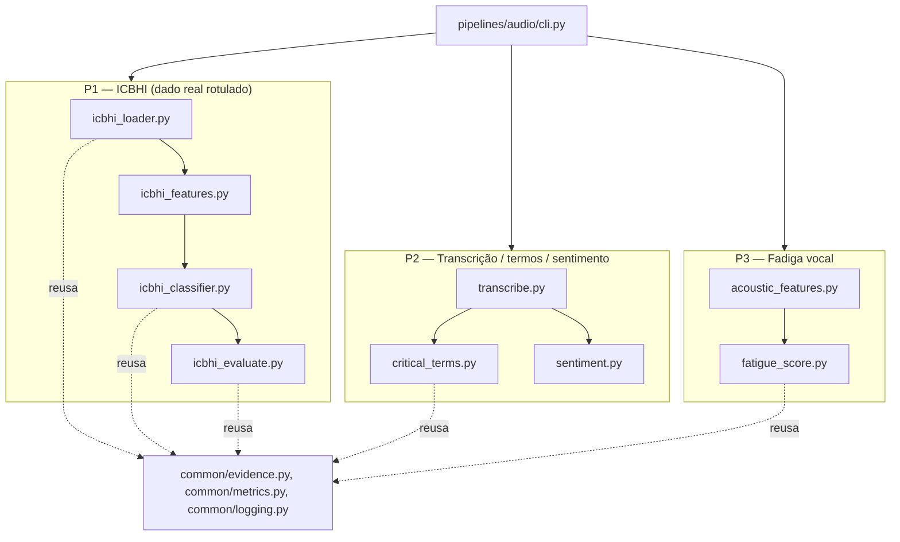

# F2 (audio-analysis) Design

**Spec**: `.specs/features/audio-analysis/spec.md`
**Status**: Draft

---

## Architecture Overview

F2 é 100% local (Out of Scope da spec: sem AWS — AD-034/035 não se aplicam aqui). Três raias
independentes, uma CLI que as orquestra e grava tudo sob `output/audio/<run_id>/` usando o
contrato único de evidência (AD-026):



P2 e P3 compartilham a mesma transcrição/leitura de áudio de consulta por arquivo, mas são
computados de forma independente (nenhuma dependência entre o score de fadiga e os termos
críticos) — refletindo que a spec os trata como stories independentes (P2/P3).

---

## Code Reuse Analysis

### Existing Components to Leverage

| Component | Location | How to Use |
| --- | --- | --- |
| `Evidence`/`save_evidence`/`evidence_dir` | `backend/common/evidence.py` | Reuso direto, sem alteração — contrato genérico já suporta artefato + metadados livres (AD-026). `feature="audio"`. |
| `MetricsReport`/`binary_metrics` | `backend/common/metrics.py` | Reuso direto para métricas por classe: cada classe do ICBHI vira uma chamada one-vs-rest (`binary_metrics(y_true_classe, y_pred_classe, detector=nome_da_classe)`), igual ao padrão de `vitals/evaluate.py` que chama `binary_metrics` por detector. |
| `get_logger` | `backend/common/logging.py` | Reuso direto, `get_logger("audio.<modulo>")`. |
| Padrão de config declarativa (YAML, campo desconhecido = erro, obrigatórios explícitos) | `backend/common/config.py` | **Reaplicar o padrão, não importar a classe** — ver Tech Decisions e Risks. |
| Padrão de CLI ponta-a-ponta (`run(config_path, run_id)`, `_novo_run_id()`, tratamento de `FileNotFoundError` com dica de `make data`) | `backend/pipelines/vitals/cli.py` | Mesmo esqueleto para `pipelines/audio/cli.py`. |
| Padrão de lote tolerante a falha (`registros, falhas = load_dataset(...)`, item corrompido é pulado e logado, nunca trava o lote) | `backend/pipelines/vitals/loader.py` | Mesmo padrão em `icbhi_loader.py` (AUDIO-12) e no laço de áudios de consulta da CLI. |

### Integration Points

| System | Integration Method |
| --- | --- |
| ICBHI 2017 (`data/icbhi/ICBHI_final_database/`) | Leitura direta de pares `.wav`/`.txt` já baixados por F0 (confirmado nesta sessão: 920 arquivos, 126 pacientes, 6898 ciclos anotados — bate com o número citado na spec). |
| Áudios de consulta gravados pelo grupo | Caminhos declarados em `consult_audio_paths` na config; **ainda não existem em `data/`** (bloqueador de Execute, não de Design/Tasks — nota já registrada no handoff). |
| F5 (fusão) | Consome os JSONs de evidência (`output/audio/<run_id>/*.json`) e o `metrics.json` de P1, via o mesmo contrato que F3/F1 já produzem — nenhuma integração nova a construir aqui. |

---

## Components

### `pipelines/audio/config.py`

- **Purpose**: Configuração declarativa da execução de F2 (YAML → dataclass validada).
- **Location**: `backend/pipelines/audio/config.py`
- **Interfaces**:
  - `load_config(path: Path) -> Config` — mesma disciplina de `common/config.py` (campo desconhecido é erro; obrigatórios explícitos), campos próprios de F2.
- **Campos**: `icbhi_dataset_dir` (obrigatório), `icbhi_max_patients` (default `40`), `consult_audio_paths` (default `[]`), `critical_terms_path` (default aponta para `configs/critical_terms.yaml`), `whisper_model_size` (default `"small"`), `no_speech_threshold` (default `0.6`), `sentiment_threshold` (default `0.2`), `fatigue_threshold` (default `1.0`), `seed` (default `42`), `output_root` (default `"output"`).
- **Dependencies**: `pyyaml` (já em `pyproject.toml`).
- **Reuses**: o *padrão* de `common/config.py`, não a classe (ver Tech Decisions).

### `pipelines/audio/icbhi_loader.py` (AUDIO-01, AUDIO-12, AUDIO-13)

- **Purpose**: Ler pares `.wav`/`.txt` do ICBHI, parsear o formato de nome de arquivo e as anotações por ciclo, selecionar o subconjunto curado.
- **Location**: `backend/pipelines/audio/icbhi_loader.py`
- **Interfaces**:
  - `parse_filename(name: str) -> IcbhiRecordingMeta` — extrai `patient_id`, índice de gravação, localização do estetoscópio, modo de aquisição, equipamento (`filename_format.txt`, verificado nesta sessão).
  - `load_cycles(txt_path: Path, wav_path: Path) -> list[RespiratoryCycle]` — uma linha `start end crackle wheeze` por ciclo; ciclo com linha malformada é descartado do lote (AUDIO-13), nunca contado como erro do classificador.
  - `select_subset(cycles_by_patient: dict[str, list[RespiratoryCycle]], max_patients: int, seed: int) -> list[RespiratoryCycle]` — amostra determinística de pacientes (não de ciclos soltos), preservando a integridade paciente→ciclos necessária para o split sem vazamento (ver `icbhi_classifier.py`).
  - `load_dataset(dataset_dir: Path) -> tuple[list[RespiratoryCycle], list[str]]` — retorna também a lista de arquivos pulados por erro de leitura (AUDIO-12), no mesmo padrão de `vitals.loader.load_dataset`.
- **Dependencies**: `soundfile`/`librosa` para checar integridade do WAV (arquivo corrompido levanta exceção capturada aqui).
- **Reuses**: padrão de tolerância a falha de `vitals/loader.py`.

### `pipelines/audio/icbhi_features.py` (AUDIO-01)

- **Purpose**: Extrair features espectrais/MFCC de um ciclo respiratório, agregadas para vetor de tamanho fixo (ciclos têm duração variável).
- **Location**: `backend/pipelines/audio/icbhi_features.py`
- **Interfaces**:
  - `extract(cycle: RespiratoryCycle, sr: int = 4000) -> np.ndarray` — recorta `[start_s, end_s]` do áudio, resample para `sr`, calcula MFCC (13 coef.) + centroide/bandwidth/rolloff espectral + zero-crossing rate via `librosa`, agrega por média+desvio-padrão ao longo dos frames → vetor 1-D de tamanho fixo.
- **Dependencies**: `librosa` (verificado instalado, `0.11.0`).
- **Reuses**: nada de `common/` (é específico do domínio de áudio).

### `pipelines/audio/icbhi_classifier.py` (AUDIO-02, AUDIO-03, AUDIO-14)

- **Purpose**: Treinar e avaliar o classificador respiratório leve, com split sem vazamento de paciente.
- **Location**: `backend/pipelines/audio/icbhi_classifier.py`
- **Interfaces**:
  - `split_by_patient(cycles: list[RespiratoryCycle], test_size: float, seed: int) -> tuple[list, list]` — usa `sklearn.model_selection.GroupShuffleSplit` agrupando por `patient_id`, nunca por ciclo solto (evita o mesmo paciente aparecer em treino e teste).
  - `train(cycles: list[RespiratoryCycle], seed: int) -> IcbhiClassifier` — `RandomForestClassifier(n_estimators=200, class_weight="balanced", random_state=seed)` sobre os vetores de `icbhi_features.extract`.
  - `predict(model: IcbhiClassifier, cycle: RespiratoryCycle) -> Prediction` — classe prevista (`normal`/`crackle`/`wheeze`/`both`) + score de confiança (`predict_proba` da classe vencedora).
- **Dependencies**: `scikit-learn` (já em `pyproject.toml`).
- **Reuses**: nada persistido em disco — o modelo é treinado a cada execução sobre o subconjunto curado (ver Tech Decisions, sem cache de modelo).

### `pipelines/audio/icbhi_evaluate.py` (AUDIO-04)

- **Purpose**: Precision/recall/F1 por classe contra o rótulo real do ICBHI.
- **Location**: `backend/pipelines/audio/icbhi_evaluate.py`
- **Interfaces**:
  - `evaluate(y_true: list[str], y_pred: list[str], classes: tuple[str, ...]) -> list[MetricsReport]` — para cada classe, monta `y_true`/`y_pred` booleanos one-vs-rest e chama `common.metrics.binary_metrics(..., detector=classe)`.
  - `save_evaluation(reports: list[MetricsReport], path: Path) -> None` — grava `metrics.json` (lista serializada), mesmo padrão de `vitals.evaluate.save_evaluation`.
- **Reuses**: `common/metrics.py` (`binary_metrics`), sem wrapper adicional (diferente de F3, aqui não há "prevalência" agregada relevante o suficiente para justificar um wrapper novo — YAGNI).

### `pipelines/audio/icbhi_evidence.py` (AUDIO-05)

- **Purpose**: Espectrograma + metadados para todo ciclo previsto como não-normal.
- **Location**: `backend/pipelines/audio/icbhi_evidence.py`
- **Interfaces**:
  - `plot_spectrogram(cycle: RespiratoryCycle, path: Path) -> Path` — mel-spectrogram em dB via `librosa.feature.melspectrogram` + `librosa.display.specshow`, salvo como PNG.
  - `evidence_id_for(cycle: RespiratoryCycle, predicted: str) -> str` — `f"{record_id}-cycle{idx}-{predicted}"`, mesmo princípio de `vitals.cli.evidence_id_de` (derivado do evento, nunca montado em paralelo).
- **Reuses**: `common/evidence.py` (`save_evidence`).

### `pipelines/audio/transcribe.py` (AUDIO-06, AUDIO-10, AUDIO-14)

- **Purpose**: Transcrição pt-BR local via faster-whisper, com sinalização de transcrição não confiável.
- **Location**: `backend/pipelines/audio/transcribe.py`
- **Interfaces**:
  - `transcribe(audio_path: Path, model_size: str, no_speech_threshold: float) -> Transcript` — `WhisperModel(model_size, device="cpu", compute_type="int8")`, `model.transcribe(audio_path, language="pt", temperature=0.0, beam_size=5)` (`temperature=0.0` fixo — API real confirmada nesta sessão via introspecção; desliga o fallback de amostragem estocástica, condição necessária para AUDIO-14/determinismo). `Transcript.reliable = bool(texto não vazio) and (média de no_speech_prob dos segmentos <= no_speech_threshold)`.
- **Dependencies**: `faster-whisper` (verificado instalado e API introspectada nesta sessão: `Segment` expõe `start`, `end`, `text`, `avg_logprob`, `no_speech_prob`).
- **Reuses**: nada de `common/`.

### `pipelines/audio/critical_terms.py` (AUDIO-07, AUDIO-09)

- **Purpose**: Buscar termos críticos configuráveis no transcript, com contexto e timestamp aproximado.
- **Location**: `backend/pipelines/audio/critical_terms.py`
- **Interfaces**:
  - `load_terms(path: Path | None) -> list[str]` — carrega YAML; se ausente/vazio, usa a lista padrão embutida (`dor no peito`, `falta de ar`, `tontura` + termos adicionais do brief) — AUDIO edge case "lista vazia usa a padrão".
  - `find_terms(transcript: Transcript, terms: list[str]) -> list[CriticalTermHit]` — normalização (minúsculas + remoção de acento via `unicodedata`) para casar robustamente; cada `CriticalTermHit` tem `term`, `context` (±40 caracteres), `approx_timestamp_s` (início do segmento whisper que contém o match).
  - `save_term_evidence(hit: CriticalTermHit, transcript: Transcript, run_id, ...) -> Evidence` — artefato é um `.txt` com o transcript e o termo destacado (`**termo**`), metadados incluem `context`/`approx_timestamp_s`.
- **Reuses**: `common/evidence.py`.

### `pipelines/audio/sentiment.py` (AUDIO-08)

- **Purpose**: Sentimento local (positivo/negativo/neutro) via léxico pt-BR embutido, sem chamada a serviço de nuvem (AD-002/003).
- **Location**: `backend/pipelines/audio/sentiment.py`
- **Interfaces**:
  - `classify(transcript_text: str, threshold: float) -> SentimentResult` — conta ocorrências normalizadas de um léxico curado embutido (`configs/sentiment_lexicon.yaml`, positivas/negativas), `score = (pos - neg) / (pos + neg)` se houver ao menos um hit, senão `0.0`; `|score| < threshold` → `"neutro"`, senão `"positivo"`/`"negativo"`.
- **Reuses**: mesma normalização de texto de `critical_terms.py` (função compartilhada, ver Tech Decisions).

### `pipelines/audio/acoustic_features.py` (AUDIO-11)

- **Purpose**: Extrair jitter, shimmer, HNR (Parselmouth/Praat), taxa de pausas e velocidade de fala.
- **Location**: `backend/pipelines/audio/acoustic_features.py`
- **Interfaces**:
  - `extract(audio_path: Path, transcript: Transcript) -> AcousticFeatures` — receita Praat **testada nesta sessão contra um sinal sintético** (valores plausíveis: jitter≈0.3%, shimmer≈1.8%, HNR≈19.6 dB):
    ```python
    snd = parselmouth.Sound(str(audio_path))
    pitch = call(snd, "To Pitch", 0.0, 75, 500)
    pp = call(snd, "To PointProcess (periodic, cc)", 75, 500)
    jitter_local = call(pp, "Get jitter (local)", 0, 0, 0.0001, 0.02, 1.3)
    shimmer_local = call([snd, pp], "Get shimmer (local)", 0, 0, 0.0001, 0.02, 1.3, 1.6)
    harmonicity = call(snd, "To Harmonicity (cc)", 0.01, 75, 0.1, 1.0)
    hnr = call(harmonicity, "Get mean", 0, 0)
    ```
    Pausas via `librosa.effects.split(y, top_db=...)` (taxa = duração total de silêncio / duração total); velocidade de fala = contagem de palavras do transcript / duração de fala.
- **Dependencies**: `praat-parselmouth` (verificado instalado, `0.4.7`, Praat `6.1.38`), `librosa`.
- **Reuses**: nada de `common/`.

### `pipelines/audio/fatigue_score.py` (AUDIO-11)

- **Purpose**: Score heurístico de fadiga/qualidade vocal a partir das features acústicas.
- **Location**: `backend/pipelines/audio/fatigue_score.py`
- **Interfaces**:
  - `score(features: AcousticFeatures, baseline: list[AcousticFeatures]) -> float` — z-score de cada feature contra o `baseline` (todos os áudios de consulta processados na mesma execução — não há referência populacional externa disponível), combinados em média simples de `[jitter_z, shimmer_z, -hnr_z, pause_rate_z, -speaking_rate_z]` (sinal invertido nas features "quanto maior, melhor": HNR e velocidade de fala).
  - `is_fatigued(score: float, threshold: float) -> bool`.
- **Reuses**: nada de `common/` (fórmula é local ao domínio; documentação/justificativa formal vai no relatório técnico, não no código).

### `pipelines/audio/cli.py` (orquestração)

- **Purpose**: Pipeline ponta a ponta — o que uma futura entrada `make demo-audio` executaria.
- **Location**: `backend/pipelines/audio/cli.py`
- **Interfaces**: `run(config_path: Path, run_id: str | None) -> int`, `main(argv) -> int` — mesmo formato de `vitals/cli.py`, incluindo a dica de `make data` em `FileNotFoundError`.
- **Reuses**: `common/evidence.py`, `common/logging.py`, o esqueleto de `vitals/cli.py`.

---

## Data Models

```python
# icbhi_loader.py
@dataclass(frozen=True)
class IcbhiRecordingMeta:
    patient_id: str
    recording_index: str
    chest_location: str
    acquisition_mode: str
    equipment: str

@dataclass(frozen=True)
class RespiratoryCycle:
    record_id: str          # nome do arquivo sem extensão
    patient_id: str
    cycle_index: int
    start_s: float
    end_s: float
    wav_path: Path
    label: str               # "normal" | "crackle" | "wheeze" | "both"

# icbhi_classifier.py
@dataclass(frozen=True)
class Prediction:
    record_id: str
    cycle_index: int
    predicted_label: str
    confidence: float

# transcribe.py
@dataclass(frozen=True)
class TranscriptSegment:
    start_s: float
    end_s: float
    text: str
    no_speech_prob: float

@dataclass(frozen=True)
class Transcript:
    audio_path: Path
    text: str
    segments: list[TranscriptSegment]
    reliable: bool

# critical_terms.py
@dataclass(frozen=True)
class CriticalTermHit:
    term: str
    context: str
    approx_timestamp_s: float | None

# sentiment.py
@dataclass(frozen=True)
class SentimentResult:
    label: str                # "positivo" | "negativo" | "neutro"
    score: float

# acoustic_features.py
@dataclass(frozen=True)
class AcousticFeatures:
    jitter_local: float
    shimmer_local: float
    hnr_db: float
    pause_rate: float
    speaking_rate_wps: float
```

**Relationships**: `RespiratoryCycle` → `Prediction` (1:1, por ciclo) → `MetricsReport` (agregado por classe). `Transcript` → `CriticalTermHit` (1:N) e `Transcript` → `SentimentResult` (1:1). `AcousticFeatures` → score de fadiga (1:1, contra o baseline da mesma execução).

---

## Error Handling Strategy

| Error Scenario | Handling | User Impact |
| --- | --- | --- |
| WAV do ICBHI corrompido/ilegível (AUDIO-12) | `icbhi_loader.load_dataset` captura a exceção, loga e adiciona à lista `falhas`; ciclos desse arquivo não entram no treino/avaliação | Nenhum: o lote continua; contagem de descartados aparece no log final, igual ao padrão de F3 |
| Linha de anotação malformada / ciclo sem rótulo válido (AUDIO-13) | Ciclo excluído do denominador de métricas, nunca contado como erro do classificador | Métricas honestas, sem inflar falso-negativo |
| Áudio de consulta corrompido/formato não suportado (AUDIO-12) | Mesmo padrão: captura, loga, pula, segue para o próximo arquivo | Processamento do lote não trava |
| Transcrição vazia/ruído excessivo (AUDIO-10) | `Transcript.reliable = False`; CLI pula termos críticos/sentimento para esse arquivo e loga "transcrição vazia/não confiável" | Nenhum falso positivo de termo crítico reportado |
| Lista de termos críticos vazia/ausente | `load_terms` retorna a lista padrão embutida em vez de falhar | Comportamento previsível sem intervenção |
| `consult_audio_paths` vazio na config | P2/P3 são puladas com um `log.warning`; P1 roda normalmente | CLI não falha — permite rodar só o ICBHI antes dos áudios existirem |

---

## Risks & Concerns

| Concern | Location | Impact | Mitigation |
| --- | --- | --- | --- |
| `common/config.py` está sob `common/` mas é, na prática, específico de `vitals` (campos hardcoded: `window_size_s`, `zscore_threshold`, etc.) — o nome sugere reuso genérico que não existe | `backend/common/config.py:38-48` | Uma feature nova pode tentar importar `Config`/`load_config` esperando generalidade e ser forçada a um formato errado | F2 **não reusa** essa classe — cria `pipelines/audio/config.py` própria, reaplicando só o *padrão* de validação. Não bloqueante para F2; renomear/genericizar `common/config.py` fica como limpeza futura fora do escopo desta feature. |
| Vazamento de paciente no split treino/teste do ICBHI inflaria precision/recall artificialmente (mesmo paciente com ciclos em ambos os lados) | `icbhi_classifier.py` (a construir) | Métricas otimistas, não defensáveis no relatório técnico | Split feito por `GroupShuffleSplit` agrupado por `patient_id`, nunca por ciclo solto — requisito de design explícito, não deixado implícito para a Execute. |
| Léxico de sentimento é uma lista curada pelo próprio agente (nenhuma biblioteca/lexicon pt-BR verificado foi encontrada no prazo desta sessão) | `pipelines/audio/sentiment.py` (a construir) | Qualidade do sentimento é heurística, não validada externamente | Já é a postura assumida pela spec para P2 ("avaliação qualitativa", sem ground truth externo); documentar explicitamente no relatório técnico, igual ao score de fadiga (P3). |
| Nenhum caso de "both" (crackle+wheeze simultâneo) é mencionado explicitamente na spec, que fala em "crackle/wheeze/normal" | `spec.md` AC1/AC4 de P1 | Ciclos "both" (506 de 6898, medido nesta sessão) ficariam sem tratamento definido | Ver SPEC_DEVIATION em Tech Decisions — tratado como 4ª classe, nunca descartado (dado real rotulado não é descartado silenciosamente, mesmo princípio de AD-027/VITALS-09). |
| Baseline do z-score de fadiga (P3) degenera quando `consult_audio_paths` tem um único áudio | `pipelines/audio/fatigue_score.py::_zscore`, chamado por `cli.py::_run_p2_p3` | Com 1 único áudio, o baseline é o próprio áudio: desvio-padrão de cada feature é 0, `_zscore` sempre devolve `0.0` (guarda explícita, sem NaN/erro), logo `score()` é sempre `0.0` e a evidência "possível fadiga vocal" nunca é gerada — mesmo que a spec permita explicitamente "1–2 gravações curtas" | Aceito como limitação, não redesenhado nesta rodada (mesmo padrão do gap já aceito em T8): a evidência de fadiga só é alcançável com ≥2 áudios de consulta na mesma execução; o cenário de referência testado (`test_audio_pipeline.py`) usa 2 áudios propositalmente por causa disso. Documentar no relatório técnico que a demo deve gravar ao menos 2 áudios de consulta para que P3 produza evidência. |

> Nenhum outro problema de código pré-existente identificado na área tocada por F2 (módulo novo, sem dependência de código legado além de `common/`).

---

## Tech Decisions

| Decision | Choice | Rationale |
| --- | --- | --- |
| Classes do classificador ICBHI | 4 classes: `normal`/`crackle`/`wheeze`/`both` (não 3) | **SPEC_DEVIATION**: a spec descreve "crackle/wheeze/normal", mas o rótulo real do ICBHI permite crackle+wheeze simultâneos (506/6898 ciclos medidos nesta sessão). Descartar esses ciclos violaria o princípio (já estabelecido em F3/AD-027) de nunca tratar dado real rotulado como ruído por conveniência. AC1/AC4 continuam válidos: "classe real" passa a ter 4 valores possíveis; qualquer classe ≠ `normal` é "anômala" para fins de evidência (AC5). |
| Algoritmo do classificador respiratório | `RandomForestClassifier(n_estimators=200, class_weight="balanced")` | Decisão em aberto na spec ("confirmed: n"). Random Forest lida com fronteiras não-lineares entre crackle/wheeze sem exigir normalização de features nem tuning fino, e `class_weight="balanced"` absorve o desbalanceamento natural (crackle 27%, wheeze 13%, both 7%, normal 53%) sem reamostragem manual — mais simples que regressão logística com engenharia de features adicional, ainda CPU-leve (AD-012). |
| Cache/persistência do modelo treinado | Nenhum — treina do zero a cada execução sobre o subconjunto curado | AD-008 (demo-first): subconjunto de ~40 pacientes (~2200 ciclos) treina em segundos em CPU; persistir/versionar um `.pkl` adicionaria complexidade sem ganho perceptível para uma demo. |
| Subconjunto curado do ICBHI | Amostra determinística de `icbhi_max_patients` (default 40) pacientes, `seed`-based, todos os ciclos desses pacientes inclusos | Preserva a integridade paciente→ciclos exigida pelo split sem vazamento; 40 pacientes cobrem as 4 classes com folga (medido: 126 pacientes/6898 ciclos no total). |
| `common/config.py` não é reusado por F2 | `pipelines/audio/config.py` própria, mesmo padrão de validação | Ver Risks & Concerns — `common/config.py` é de fato específico de `vitals`, não genérico. |
| Determinismo da transcrição (AUDIO-14) | `temperature=0.0` fixo (desliga o fallback estocástico do faster-whisper) | Confirmado via introspecção da assinatura real de `WhisperModel.transcribe` nesta sessão: o default é uma lista de temperaturas (fallback ladder), que reintroduziria não-determinismo se deixado no default. |
| Baseline do z-score de fadiga (P3) | Calculado sobre os áudios de consulta processados na mesma execução (sem referência populacional externa) | Não existe dataset rotulado de fadiga vocal pt-BR disponível no prazo (mesma limitação já assumida na spec para P2/P3); documentar como heurística relativa, não absoluta, no relatório técnico. |

> Nenhuma das decisões acima é um novo `AD-NNN` de projeto — são decisões locais à F2 (algoritmo, formato de classe, split), não constraints que outras features precisem seguir. Exceção potencial: se uma feature futura quiser reusar `common/config.py`, a limpeza sinalizada no Risks passa a ser relevante — mas isso é matéria de decisão futura, não desta.

---

## Requirement Traceability (atualização)

| Requirement ID | Componente(s) |
| --- | --- |
| AUDIO-01 | `icbhi_loader.py`, `icbhi_features.py` |
| AUDIO-02 | `icbhi_classifier.py` (`train`) |
| AUDIO-03 | `icbhi_classifier.py` (`predict`) |
| AUDIO-04 | `icbhi_evaluate.py` |
| AUDIO-05 | `icbhi_evidence.py` |
| AUDIO-06 | `transcribe.py` |
| AUDIO-07 | `critical_terms.py` (`find_terms`) |
| AUDIO-08 | `sentiment.py` |
| AUDIO-09 | `critical_terms.py` (`save_term_evidence`) |
| AUDIO-10 | `transcribe.py` (`Transcript.reliable`) |
| AUDIO-11 | `acoustic_features.py`, `fatigue_score.py` |
| AUDIO-12 | `icbhi_loader.py`, `cli.py` (laço de áudio de consulta) |
| AUDIO-13 | `icbhi_loader.py` (`load_cycles`) |
| AUDIO-14 | `transcribe.py` (`temperature=0.0`), `icbhi_classifier.py` (`random_state=seed`) |
