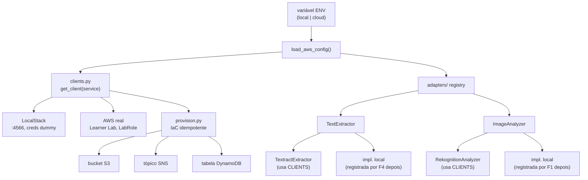

# aws-foundation Design

**Spec**: `.specs/features/aws-foundation/spec.md`
**Status**: Draft

---

## Architecture Overview

Três peças desacopladas, cada uma consumida pelas features futuras (F4/F1/F5) sem que elas
conheçam AWS diretamente:



**Regra de isolamento (AD-034):** nenhum código fora de `backend/aws/clients.py` chama
`boto3.client(...)` diretamente. Um teste de guarda (grep) torna isso executável, não só
convenção.

---

## Code Reuse Analysis

| Elemento | Origem | Uso |
| --- | --- | --- |
| `backend/common/logging.py` | F3 (`get_logger`) | log estruturado em `clients.py`/`adapters/`/`provision.py` |
| `backend/common/config.py` (padrão) | F3 | inspiração para `load_aws_config()` — validação explícita, campo a campo, erro nomeando o que falta |
| `docker-compose.yml`, `.env.example` | esqueleto já commitado (AD-037) | `make localstack-up`; variáveis já documentadas |
| `pyproject.toml` (`boto3`) | já adicionado ao instalar a dependência | sem nova instalação |

Não há adapter/factory anterior no repo — greenfield dentro de `backend/aws/`.

---

## Components

### `backend/aws/clients.py`

- **Purpose**: Único ponto de criação de clientes boto3; resolve `ENV` uma vez e aplica a config certa.
- **Location**: `backend/aws/clients.py`
- **Interfaces**:
  - `load_aws_config() -> AwsConfig` — lê `ENV`, `AWS_REGION`, e (se `local`) `LOCALSTACK_ENDPOINT`; valida e falha nomeando o campo ausente ou o `ENV` inválido
  - `get_client(service: str, config: AwsConfig | None = None) -> Any` — devolve `boto3.client(service, ...)` com `endpoint_url` só se `local`
- **Dependencies**: `boto3`, `os.environ`
- **Reuses**: `common/logging.py`

### `backend/aws/adapters/__init__.py` (ou `base.py`)

- **Purpose**: Interfaces (`TextExtractor`, `ImageAnalyzer`) + registro/seleção por `ENV`.
- **Location**: `backend/aws/adapters/__init__.py`
- **Interfaces**:
  - `class TextExtractor(Protocol): def extract(self, pdf_bytes: bytes) -> ExtractedText`
  - `class ImageAnalyzer(Protocol): def analyze(self, image_bytes: bytes) -> ImageAnalysis`
  - `register_text_extractor(env: str, factory: Callable[[], TextExtractor]) -> None`
  - `register_image_analyzer(env: str, factory: Callable[[], ImageAnalyzer]) -> None`
  - `get_text_extractor(env: str | None = None) -> TextExtractor` — resolve pelo `ENV` ativo; **erro claro** se nada registrado (nunca `None`)
  - `get_image_analyzer(env: str | None = None) -> ImageAnalyzer`
- **Dependencies**: —
- **Reuses**: —
- **Nota de escopo**: o **registro** das implementações **locais** (Tesseract/pdfplumber, YOLOv8) é feito por F4/F1 quando forem construídas — a fundação só define o mecanismo e registra as implementações **cloud** (abaixo).

### `backend/aws/adapters/cloud.py`

- **Purpose**: Implementações cloud dos dois adapters, wrappers finos sobre Textract/Rekognition via `clients.get_client`.
- **Location**: `backend/aws/adapters/cloud.py`
- **Interfaces**:
  - `class TextractExtractor: def extract(self, pdf_bytes) -> ExtractedText` — chama `detect_document_text`, extrai linhas de `Blocks` tipo `LINE`, preserva a resposta bruta em `.raw` (parsing de campos de prescrição é da F4, não daqui)
  - `class RekognitionAnalyzer: def analyze(self, image_bytes) -> ImageAnalysis` — chama `detect_labels`, mapeia para `ImageLabel(name, confidence)`, preserva `.raw`
- **Dependencies**: `clients.get_client`
- **Reuses**: `clients.py`
- **Registro**: no import do módulo (ou numa função `register_cloud_adapters()` chamada explicitamente), registra as duas implementações para `env="cloud"`.

### `backend/aws/provision.py`

- **Purpose**: IaC idempotente — cria (ou confirma existência de) bucket S3, tópico SNS e tabela DynamoDB, iguais nos dois ambientes.
- **Location**: `backend/aws/provision.py`
- **Interfaces**:
  - `ensure_bucket(name: str) -> ProvisionResult`
  - `ensure_topic(name: str) -> ProvisionResult`
  - `ensure_table(name: str) -> ProvisionResult`
  - `main()` — lê nomes do `.env` (`S3_BUCKET`, `SNS_TOPIC`, `DYNAMODB_TABLE`), chama os três `ensure_*`, loga resultado; ponto de entrada de `make infra-local`/`infra-cloud` (`python -m aws.provision`, conforme `Makefile` já commitado)
  - Cada `ensure_*` **checa existência antes de criar** (não usa "criar e ignorar erro" — verifica primeiro via `head_bucket`/`get_topic_attributes`/`describe_table`, cria só se ausente); idempotência real, não dependente de exceção específica de "já existe"
- **Dependencies**: `clients.get_client`
- **Reuses**: `clients.py`

---

## Data Models

```python
@dataclass(frozen=True)
class AwsConfig:
    env: str                 # "local" | "cloud"
    region: str
    endpoint_url: str | None # só quando env == "local"

@dataclass(frozen=True)
class ImageLabel:
    name: str
    confidence: float

@dataclass(frozen=True)
class ExtractedText:
    lines: list[str]
    raw: dict                # resposta bruta do provedor — parsing específico fica com a feature

@dataclass(frozen=True)
class ImageAnalysis:
    labels: list[ImageLabel]
    raw: dict

@dataclass(frozen=True)
class ProvisionResult:
    resource: str
    created: bool             # True se criou agora; False se já existia
```

---

## Error Handling Strategy

| Cenário | Tratamento | Impacto |
| --- | --- | --- |
| `ENV` ausente ou fora de `{local, cloud}` | `load_aws_config` levanta `ValueError` nomeando o valor recebido | Erro antes de qualquer chamada AWS |
| Variável obrigatória ausente (`AWS_REGION`, ou `LOCALSTACK_ENDPOINT` quando `local`) | Erro nomeando a variável | Config nunca fica parcialmente resolvida |
| Nenhum adapter registrado para o `ENV` ativo | `get_text_extractor`/`get_image_analyzer` levantam erro nomeando o `ENV` | Nunca devolve `None` silenciosamente |
| LocalStack fora do ar (`ENV=local`) | Chamada boto3 propaga erro de conexão; mensagem de log sugere `make localstack-up` | Erro acionável, não traceback cru |
| `ensure_*` chamado 2x seguidas | Segunda chamada detecta o recurso existente e não recria | Idempotência (mesmo padrão de F0) |

---

## Risks & Concerns

| Concern | Impacto | Mitigação |
| --- | --- | --- |
| **Textract/Rekognition não existem no LocalStack Community** | Os wrappers cloud não podem ser testados via LocalStack real, mesmo com `ENV=local` | Testes de `cloud.py` usam um **cliente boto3 fake injetado** (duck-typing simples: objeto com `detect_document_text`/`detect_labels` retornando um dict fixo) para validar o *parsing*, sem precisar de LocalStack nem de credenciais reais. A chamada de rede de verdade só é validável manualmente contra o Learner Lab — documentar essa limitação no relatório |
| **`get_client` sem validação de `service`** | Nome de serviço inválido só falha dentro do boto3, com mensagem genérica | Aceitável — boto3 já valida; não duplicar essa validação |
| **Registro de adapters é estado global mutável** (módulo) | Testes que registram fakes podem "vazar" entre casos de teste se não limparem o registro | Fixture de teste reseta o registro antes/depois de cada caso |
| **`ensure_*` faz round-trip de leitura antes de criar** | Uma chamada extra de API por recurso, a cada execução | Aceitável — `make infra-*` não roda em hot path, só em setup |

> Sem código legado para flagear — feature nova, greenfield.

---

## Tech Decisions

| Decisão | Escolha | Rationale |
| --- | --- | --- |
| Seleção de cliente por ambiente | Uma função (`get_client`) decide `endpoint_url` a partir de `AwsConfig.env` | AD-034 — único ponto, testável sem rede (só inspeciona a config resolvida) |
| Adapters cloud vs local | Fundação implementa e registra os **cloud** (Textract/Rekognition); **local** é registrado por F4/F1 quando forem construídas | Já decidido no Out of Scope da spec; mantém a fundação sem dependência de Tesseract/YOLOv8 |
| Mecanismo de seleção de adapter | Registro explícito (`register_*`) + resolução por `ENV`, erro se ausente | Cobre AC2 (P3) sem exigir que as implementações locais existam ainda |
| Teste dos wrappers cloud | Cliente boto3 **fake por duck-typing** (não moto, não LocalStack) | Textract/Rekognition não existem no LocalStack Community; um objeto Python com os métodos certos é suficiente e não adiciona dependência |
| Idempotência da IaC | Checar existência antes de criar (não "criar e capturar exceção") | Mais explícito e testável; evita depender do texto exato de exceções de "recurso já existe" |
| Testes de integração de `provision.py` | LocalStack real (Docker), conforme AD-038 | S3/SNS/DynamoDB existem no Community; aqui a fidelidade ao ambiente-alvo vale o custo do Docker |

> Nenhuma decisão aqui é nova a nível de projeto — AD-034, AD-035, AD-038 já cobrem o essencial.
