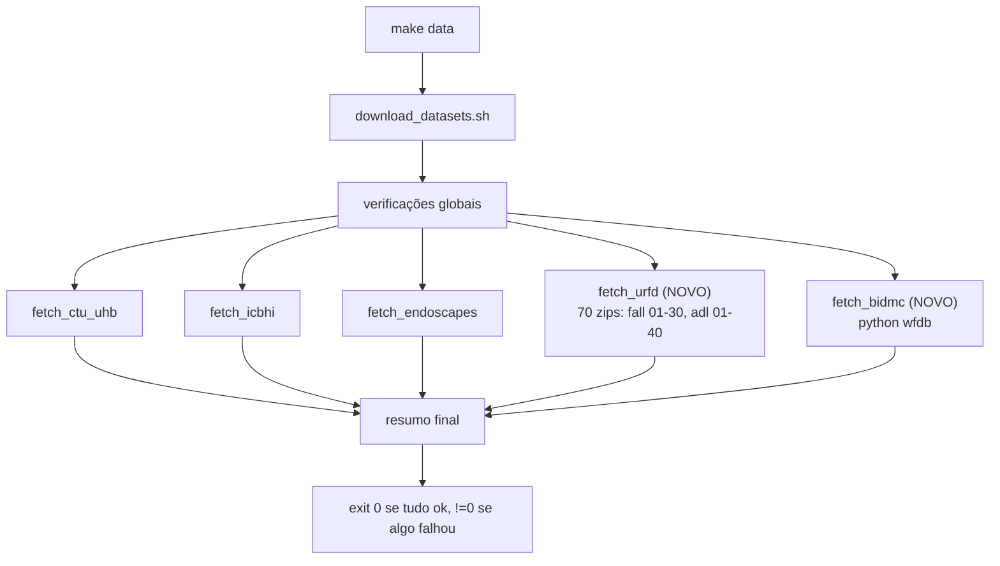
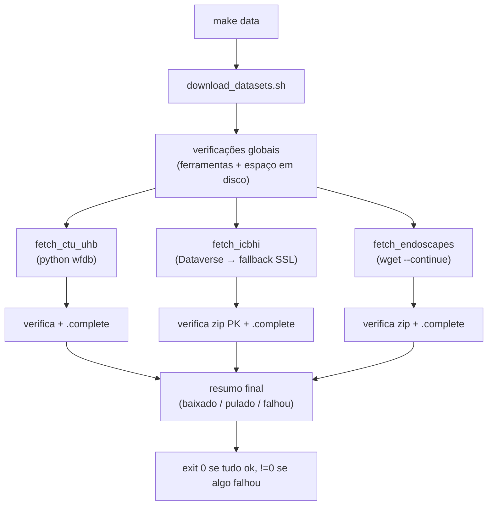

# F0 — Data Acquisition Design

**Spec**: `.specs/features/data-acquisition/spec.md`
**Status**: Draft (núcleo Verified; emenda URFD/BIDMC em Design)

---

## ⚠️ EMENDA (2026-07-21) — DATA-14 (URFD) e DATA-15 (BIDMC)

Estende o design abaixo com dois novos `fetch_*`, seguindo o mesmo contrato (pula se completo →
baixa → verifica → `.complete`). Endoscapes confirmado pelo usuário como **mantido** no script
(5 fontes no total).

### Achados verificados (URFD/BIDMC)

| Fonte | Fato verificado | Consequência no design |
| --- | --- | --- |
| URFD | Página `fenix.ur.edu.pl/~mkepski/ds/uf.html` responde HTTP 200. Zip de sequência (`fall-01-cam0-rgb.zip`) responde **HTTP 206**, `Content-Type: application/zip`, magic bytes `PK` | Um `wget --continue` por sequência, mesmo padrão de `verify_zip` já existente |
| URFD (nomenclatura) | Convenção `{fall,adl}-NN-cam0-rgb.zip`, NN zero-padded 2 dígitos; fall vai de 01–30, adl de 01–40 (AD-039) | Loop de nomes gerado no script, não lista hardcoded de 70 URLs |
| BIDMC | Página `physionet.org/content/bidmc/1.0.0/` responde HTTP 200; `wfdb.get_record_list('bidmc')` retorna 53 registros contíguos `bidmc01`..`bidmc53` | Mesmo padrão do CTU-UHB: `wfdb.dl_database('bidmc', dest)` para as formas de onda |
| **BIDMC — achado crítico** | Os arquivos de **numerics** (HR/PULSE/RESP/SpO2 a 1 Hz — o que AD-040 realmente quer) são **registros separados com sufixo `n`** (ex. `bidmc01n`) que **NÃO aparecem no arquivo `RECORDS`** do dataset. Confirmado baixando `bidmc01` isoladamente (só vieram `.hea`/`.dat` de forma de onda, 125 Hz, sig_name `RESP,PLETH,V,AVR,II`) e depois `bidmc01n` explicitamente (sig_name `HR,PULSE,RESP,SpO2`, 1 Hz). `dl_database(records='all')` **nunca baixa os numerics** sozinho. | `fetch_bidmc` precisa de **duas chamadas**: uma para as formas de onda (`records='all'`) e outra para os numerics, com a lista de nomes derivada de `get_record_list` + sufixo `'n'` (não hardcoded), e a checagem de completude exige a presença de **ambos** os grupos |

### Architecture Overview (atualizado)



### Componentes novos

**`fetch_urfd()`**
- Itera `fall-01`..`fall-30` e `adl-01`..`adl-40` (contagens de AD-039); para cada sequência, baixa
  `${URFD_BASE_URL}/<seq>-cam0-rgb.zip` com `wget --continue`, roda `verify_zip`, `unzip -o -q` para
  `data/urfd/<seq>/`.
- **Idempotência por sequência, não só por dataset**: se `data/urfd/<seq>/.complete` existe, pula
  aquela sequência individualmente (evita rebaixar 69 zips já prontos por causa de 1 que faltou).
  `data/urfd/.complete` (nível dataset) só é escrito quando **todas** as sequências estão completas.
- Uma sequência que falha é registrada e não impede as demais (mesmo princípio de "falha de um não
  derruba os outros", agora dentro do próprio fetch).
- **Variável nova**: `URFD_BASE_URL` (`https://fenix.ur.edu.pl/~mkepski/ds/data`), `URFD_N_FALL=30`,
  `URFD_N_ADL=40`.

**`fetch_bidmc()`**
- **Duas chamadas** de `wfdb.dl_database`: (1) `records='all'` para as 53 formas de onda; (2) uma
  lista explícita `[r + 'n' for r in get_record_list('bidmc')]` para os numerics (HR/SpO2/PULSE/
  RESP), que não estão no `RECORDS` e por isso não vêm com a chamada (1) sozinha.
- Completude exige **ambos os grupos**: ao menos 1 `*.hea` (forma de onda) e ao menos 1 `*n.hea`
  (numerics) antes de `mark_complete`.
- **Variável nova**: `BIDMC_DB` (`bidmc`).

### Data Models (atualizado)

```
data/
├── urfd/
│   ├── fall-01/{*.png, .complete}     # .complete por sequência
│   ├── ...
│   ├── adl-40/{*.png, .complete}
│   └── .complete                       # só quando TODAS as sequências completam
└── bidmc/{*.hea,*.dat|*.csv, .complete}
```

### Risks & Concerns (adicionais)

| Concern | Impacto | Mitigação |
| --- | --- | --- |
| **URFD é ~70 downloads pequenos**, não 1 grande | Mais superfície de falha parcial que Endoscapes/ICBHI | Sentinela por sequência (não só por dataset) evita retrabalho; falha de uma sequência não impede as outras |
| **Formato exato do BIDMC via `wfdb` não verificado ainda** (ao contrário do CTU-UHB, que já foi confirmado empiricamente) | Checagem de completude pode presumir errado | Tarefa de implementação confirma a estrutura de arquivos do BIDMC no REPL antes de escrever a checagem — mesma disciplina da T6 de F3 |
| **Tamanho total do URFD desconhecido** (não documentado na página) | `check_disk_space` pode subestimar | Estimativa conservadora inicial (a confirmar/ajustar após o primeiro download real) |

### Tech Decisions (adicionais)

| Decisão | Escolha | Rationale |
| --- | --- | --- |
| Granularidade da sentinela do URFD | Por sequência + por dataset | 70 downloads pequenos tornam retrabalho caro se só houvesse sentinela única; replica o padrão "falha de um não derruba os outros" dentro do fetch |
| BIDMC | Mesmo padrão de `fetch_ctu_uhb` (wfdb) | Reuso direto; já validado que `wfdb.dl_database` funciona para bases do PhysioNet |

---

## Achados verificados (fonte da verdade, não presumir de novo)

Confirmado empiricamente ao adiantar os downloads em paralelo:

| Fonte | Fato verificado | Consequência no design |
| --- | --- | --- |
| CTU-UHB | `wfdb.dl_database('ctu-uhb-ctgdb', dest)` funciona; enumera 552 registros e baixa `.hea`/`.dat` | Passo em Python, não shell puro |
| ICBHI (original) | `bhichallenge.med.auth.gr` tem cert SSL **autoassinado** E retorna **HTTP 403 no site inteiro** (inclusive a home); wget `-q` gravava **0 bytes** com exit 0 | Fonte primária trocada; a original vira alternativa com `--no-check-certificate` |
| ICBHI (Dataverse) | Harvard Dataverse DOI `10.7910/DVN/HT6PKI`, datafile `7127117`, zip único ~1.9 GB, **HTTP 206** (suporta resume), magic bytes `PK` | Fonte primária do ICBHI; `curl -L -C -` |
| Endoscapes | `s3.unistra.fr/.../endoscapes.zip`, HTTP 200, ~6 GB, `application/zip` | `wget --continue`; exige checagem de espaço |
| Disco | ~83 GB livres no ambiente atual | Folga para ~8 GB de datasets + margem |

**Lição incorporada** (L-020): um download pode retornar HTTP 200/exit 0 e ainda ser uma **página HTML de erro**, não o arquivo. Toda fonte deve ser validada pela assinatura/tipo do conteúdo antes de marcar `.complete`.

---

## Architecture Overview

Um único script shell (`backend/scripts/download_datasets.sh`) orquestra três aquisições
independentes, cada uma idempotente e verificada. Estado por dataset é uma sentinela `.complete`.



Cada `fetch_*` segue o mesmo contrato: **se `.complete` existe → pula; senão baixa → verifica →
escreve `.complete`**. Uma falha em um dataset não interrompe os outros; o exit code final reflete
se houve qualquer falha.

---

## Code Reuse Analysis

F0 é a primeira feature do backend a ter um script de dados; não há shell anterior a reutilizar.
O que se reaproveita:

| Elemento | Origem | Uso |
| --- | --- | --- |
| `.venv/bin/python` + `wfdb` | já instalado para F3 | passo CTU-UHB |
| Alvo `data` do Makefile | AD-030 | ponto de entrada `make data` |
| Convenção `data/<ds>/` + `.gitignore` | AD-031 | destinos e não-versionamento |

O script **não** importa código Python do backend (é infra de aquisição, roda antes de qualquer
pipeline). Mantido desacoplado de `common/`/`pipelines/`.

---

## Components

### `download_datasets.sh`

- **Purpose**: Orquestrar as três aquisições de forma idempotente e verificada.
- **Location**: `backend/scripts/download_datasets.sh`
- **Estrutura interna** (funções shell):
  - `main()` — roda checagens globais, chama os três `fetch_*`, imprime o resumo, define o exit code
  - `require_tools()` — confirma `curl`/`wget`, `unzip`, `.venv/bin/python`; falha nomeando o que falta
  - `check_disk_space(min_bytes)` — aborta se o livre < estimativa + margem
  - `is_complete(dir)` / `mark_complete(dir)` — leitura/escrita da sentinela
  - `verify_zip(path)` — confere assinatura `PK` (primeiros bytes) e tamanho > limiar; rejeita HTML/erro
  - `fetch_ctu_uhb()` — `python -c "import wfdb; wfdb.dl_database(...)"`; verifica presença de `.hea`/`.dat`
  - `fetch_icbhi()` — tenta Dataverse (`curl -L -C -`); se falhar, tenta a URL original com `--no-check-certificate`; `verify_zip` antes de `unzip`
  - `fetch_endoscapes()` — `wget --continue`; `verify_zip`; `unzip`
- **Variáveis no topo** (DATA-05): `DATA_DIR`, `ICBHI_DATAVERSE_URL`, `ICBHI_ORIGINAL_URL`, `ENDOSCAPES_URL`, `CTU_DB`, estimativas de tamanho por dataset.
- **Dependencies**: `curl`/`wget`, `unzip`, `.venv/bin/python` (`wfdb`)
- **Reuses**: —

---

## Data Models

Não há modelo de dados de aplicação. O "estado" persistido é o sistema de arquivos:

```
data/
├── README.md                # versionado
├── ctu-uhb/{*.hea,*.dat,.complete}
├── icbhi/{ICBHI_final_database.zip, <extraído>, .complete}
└── endoscapes/{endoscapes.zip, <extraído>, .complete}
```

`.complete` = contrato de idempotência. Sua presença é a única coisa que autoriza pular um dataset.

---

## Error Handling Strategy

| Cenário | Tratamento | Impacto no usuário |
| --- | --- | --- |
| Ferramenta ausente | `require_tools` aborta cedo nomeando a ferramenta + como instalar | Mensagem acionável, exit ≠ 0, sem sentinela |
| Espaço insuficiente | `check_disk_space` aborta antes de baixar | Diz espaço necessário vs. disponível |
| Download 403/HTML disfarçado de sucesso | `verify_zip` rejeita conteúdo não-PK | Não escreve `.complete`; tenta fallback (ICBHI) |
| Download interrompido | `curl -C -` / `wget --continue` retomam | Segunda execução continua de onde parou |
| Dataverse fora do ar (ICBHI) | Fallback para URL original com `--no-check-certificate` + `verify_zip` | ICBHI ainda obtível; TLS não verificado é mitigado pela verificação |
| `unzip` falha (zip corrompido/parcial) | Erro registrado, sem `.complete` | Dataset elegível a nova tentativa |
| Falha em 1 dataset | Os outros continuam; exit final ≠ 0 | Resumo mostra qual falhou |

---

## Risks & Concerns

| Concern | Impacto | Mitigação |
| --- | --- | --- |
| **`--no-check-certificate` baixa por TLS não verificado** (fonte alt. do ICBHI) | Conteúdo poderia ser adulterado/interceptado | Só na fonte alternativa; `verify_zip` (assinatura + tamanho) obrigatório antes de aceitar; Dataverse é a primária e é verificável |
| **Download "bem-sucedido" que é página de erro** (visto no ICBHI 403) | `.complete` marcado sobre lixo → idempotência corrompida, F2 quebra depois | `verify_zip` checa magic bytes `PK` e tamanho mínimo; nunca marca `.complete` sem passar |
| **Endoscapes ~6 GB** em rede acadêmica | Download longo, sujeito a corte | `wget --continue`; `check_disk_space` antes; sentinela evita rebaixar |
| **`wfdb.dl_database` sem verificação de completude** | Pode deixar o CTU-UHB pela metade | Verificar contagem mínima de `.hea`/`.dat` antes de `.complete` |
| **Estimativa de espaço imprecisa** | Aborto indevido ou download que estoura o disco | Usar soma conservadora (~10 GB) com margem; documentar no script |

> Sem código legado para flagear — feature nova, greenfield.

---

## Tech Decisions

| Decisão | Escolha | Rationale |
| --- | --- | --- |
| Fonte primária do ICBHI | Harvard Dataverse | A URL original 403a o site inteiro; Dataverse é aberto, citável e responde (206/resume) |
| Fonte alternativa do ICBHI | URL original + `--no-check-certificate` | Pedido do usuário; cobre redes onde o site responde |
| Verificação de conteúdo | Assinatura `PK` + tamanho mínimo, sempre | Um 403/HTML com exit 0 não pode virar `.complete` (L-020) |
| Idempotência | Sentinela `.complete` por dataset | Presença do diretório não distingue parcial de completo |
| Downloader | `curl -L -C -` (ICBHI/Dataverse) e `wget --continue` (Endoscapes) | Ambos suportam resume; escolha por qual lida melhor com cada origem (Dataverse redireciona 303→`curl -L`) |
| Linguagem | Shell + 1 chamada Python | Idempotência/resume/unzip são naturais em shell; CTU-UHB exige `wfdb` (Python) |
| Isolamento | Script não importa `backend/` | Aquisição roda antes dos pipelines; sem acoplamento |

> Nenhuma decisão aqui é project-level nova — as ADs relevantes (AD-030 estrutura, AD-031 F0, AD-033 Endoscapes) já estão no STATE.
