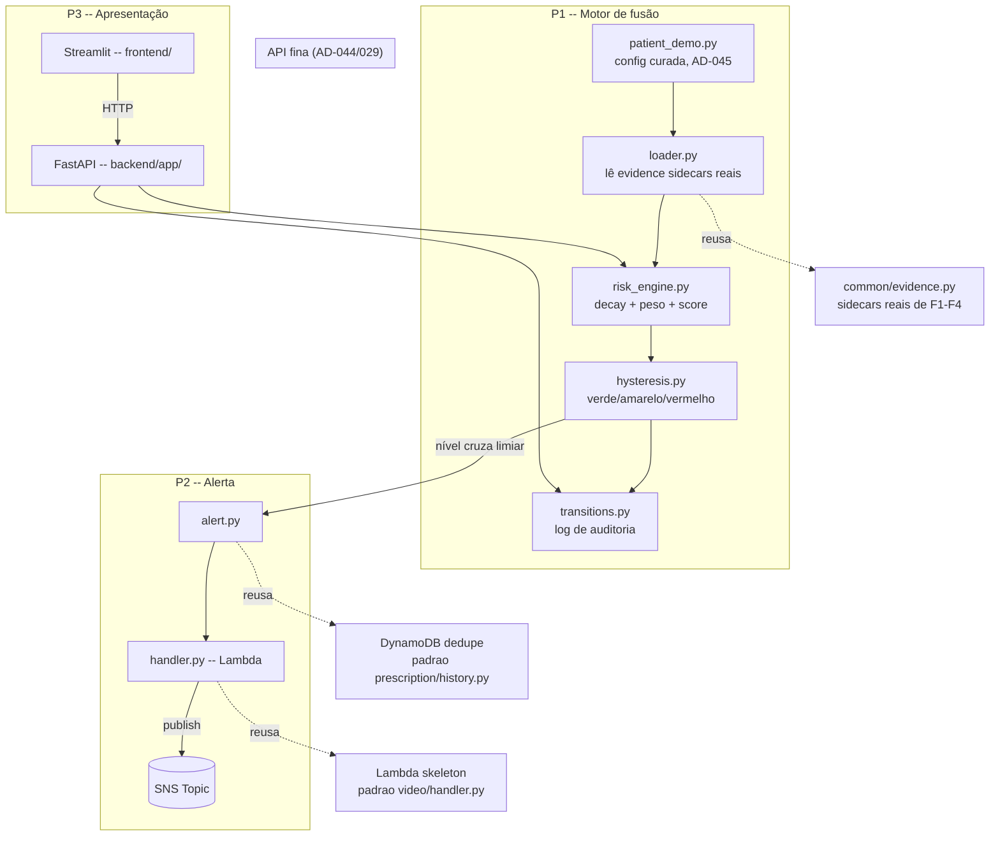

# F5 (fusion-and-alerting) Design

**Spec**: `.specs/features/fusion-and-alerting/spec.md`
**Status**: Draft

---

## Architecture Overview

F5 tem 4 camadas, cada uma consumindo a de baixo. **Camada de treino/GPU não existe aqui** — F5
é 100% CPU, consome evidências já produzidas por F1–F4 (arquivos em `output/<feature>/<run_id>/`).



**Fluxo de dados**: `patient_demo.py` (config YAML curada, AD-045a) referencia eventos reais já
detectados por F1/F2/F3/F4 (por `feature`+`run_id`+`evidence_id`) e atribui a cada um um instante
na linha do tempo da demo — `loader.py` resolve essas referências lendo os sidecars JSON reais
(nunca inventa dado). `risk_engine.py` varre a linha do tempo em janelas, combinando as
contribuições disponíveis com peso + decaimento exponencial. `hysteresis.py` classifica cada ponto
em verde/amarelo/vermelho com banda de histerese, mantendo estado entre janelas (FUSION-13).
`transitions.py` grava toda mudança de nível. Quando o nível cruza o limiar de disparo,
`alert.py` monta o payload explicável e publica via a Lambda `handler.py` → SNS, com dedupe por
evento de origem. A API expõe o resultado do motor (timeline, análise, alertas, evidência) para o
dashboard Streamlit.

---

## Code Reuse Analysis

### Existing Components to Leverage

| Component | Location | How to Use |
| --- | --- | --- |
| `Evidence`/`save_evidence`/`evidence_dir` | `backend/common/evidence.py` | `loader.py` lê os sidecars JSON já gravados por F1-F4 (mesmo contrato AD-026); nenhuma evidência nova é criada por F5 nesta camada, só lida. |
| `get_logger` | `backend/common/logging.py` | Reuso direto em todos os módulos novos. |
| Padrão de config declarativa própria por feature (YAML, campo desconhecido = erro) | `pipelines/audio/config.py` (precedente de F2) | Mesmo padrão para `patient_demo.py` — config própria de F5, não reusa `common/config.py` (específico de vitals, ver design.md de F2). |
| `aws/clients.py` (factory por `ENV`) | `backend/aws/clients.py` | Reuso direto no `handler.py`/`infra.py` de F5. |
| `ensure_bucket`/`ensure_topic`/`ensure_table` | `backend/aws/provision.py` | Reuso direto — o tópico SNS (`SNS_TOPIC=mm-alerts`) e a tabela DynamoDB genérica já são provisionados pela fundação. **Nova função aditiva** `ensure_subscription` (inscrição de e-mail no tópico) — ver Tech Decisions. |
| Padrão de dedupe DynamoDB (`ConditionExpression="attribute_not_exists(...)"`) | `backend/pipelines/prescription/history.py` | Mesmo princípio para FUSION-08 (dedupe de alerta por evento de origem), reusando a MESMA tabela genérica `pk`/`sk` com um prefixo diferente (`ALERT#...`) — não cria tabela nova. |
| Esqueleto de handler Lambda fino (try/except ao redor da chamada externa, log + segue sem propagar) | `backend/pipelines/video/handler.py` | Mesmo padrão para o handler de alerta de F5. |
| Esqueleto de `infra.py` por feature (idempotente, zip do handler + deps mínimas) | `backend/pipelines/video/infra.py`, `backend/pipelines/prescription/infra.py` | Mesmo padrão para `pipelines/fusion/infra.py`. |
| `ReportEvent`-like normalização de evento cross-fonte | `backend/pipelines/video/report.py` (`ReportEvent`) | Mesmo princípio (um tipo normalizado que cada fonte se traduz para, não um tipo por fonte) aplicado em escala maior: `FusionEvent` normaliza as 4 modalidades. |

### Integration Points

| System | Integration Method |
| --- | --- |
| Evidências reais de F1 (raia pose), F2, F3, F4 | Leitura de `output/<feature>/<run_id>/<evidence_id>.json` — **pré-requisito operacional**: rodar `make demo` (F3), o CLI de F2, e a raia pose de F1 antes de F5, para que existam sidecars reais a curar. Não há geração sintética de evidência dentro de F5. |
| SNS (`mm-alerts`) | `boto3` via `aws/clients.py`; inscrição de e-mail é um passo de infra (`ensure_subscription`), confirmação do e-mail é manual (SNS exige clique de confirmação — não automatizável, documentado no `README`). |
| DynamoDB (`mm-prescriptions`, nome genérico apesar de F4 tê-lo criado) | Reuso da tabela genérica `pk`/`sk` já provisionada; F5 usa prefixo `ALERT#` para não colidir com `PATIENT#...#DRUG#...` de F4. |
| `frontend/` (Streamlit) | Consome só `backend/app/` via HTTP (`requests`) — nenhum import direto de `backend/fusion/`. |

---

## Components

### `pipelines/video/cli.py` (pré-requisito operacional, não um FUSION-NN)

- **Purpose**: **Arquivo novo, aditivo** — F1 nunca ganhou um driver ponta a ponta que grave
  evidência real em `output/video/<run_id>/` (diferente de `vitals/cli.py` e do `cli.py` de F2);
  sem isso não existe nenhum `evidence_id` real de F1 pra config do paciente-demo referenciar.
  Escopo restrito à **raia pose** (a raia objeto/Endoscapes não entra no paciente-demo, AD-045b,
  e arrastaria a complexidade de pesos fine-tuned reais — fora do escopo desta adição pontual).
- **Location**: `backend/pipelines/video/cli.py`
- **Interfaces**: `run(config_path: Path, run_id: str | None) -> int` — mesmo esqueleto de
  `vitals/cli.py`/`audio/cli.py`: carrega sequências URFD reais (`pose_loader`), roda
  `pose.py`→`pose_features.py`→`pose_detector.py` (classifica + gera evidência via
  `common.evidence.save_evidence`, já implementado em F1), grava `metrics.json` via
  `pose_evaluate.py`.
- **Reuses**: 100% código já existente e verificado de F1 (`pose_loader`, `pose.py`,
  `pose_features.py`, `pose_detector.py`, `pose_evaluate.py`) — este arquivo só os orquestra,
  nenhum é modificado.
- **Nota**: nenhum arquivo pré-existente de `pipelines/video/` é alterado; só um arquivo novo é
  adicionado. F1 permanece "FECHADA" no sentido de que seu comportamento verificado não muda —
  ver Tech Decisions.

### `pipelines/fusion/models.py`

- **Purpose**: Dataclasses compartilhadas (mesmo padrão de centralização de F1/F2).
- **Location**: `backend/pipelines/fusion/models.py`
- **Reuses**: nenhum.

### `pipelines/fusion/config.py` (fundação)

- **Purpose**: Config declarativa do paciente-demo — **não é só "1 registro por modalidade"** (como o texto original da spec sugere), é uma lista curada de eventos (AD-045a).
- **Location**: `backend/pipelines/fusion/config.py`
- **Campos do YAML**: `patient_demo_id` (obrigatório), `events` (lista obrigatória, ≥1 item, cada um: `modality` [`video`|`audio`|`vitals`|`prescription`], `feature` [nome da pasta em `output/`], `run_id`, `evidence_id`, `demo_timestamp_s`, `severity` opcional [default `1.0`]), `weights` (dict modalidade→peso, default pesos iguais 0.25 cada), `decay_half_life_s` (default `600.0` — 10 min, mesma ordem de grandeza da janela de F3), `threshold_amarelo`/`threshold_vermelho` (default `0.3`/`0.7`), `hysteresis` (default `0.05`), `window_size_s` (default `60.0`), `alert_level` (nível que dispara SNS, default `"vermelho"`), `sns_topic` (default `mm-alerts`).
- **Reuses**: o *padrão* de validação de `pipelines/audio/config.py` (campo desconhecido = erro), não uma classe compartilhada.

### `pipelines/fusion/loader.py` (FUSION-01)

- **Purpose**: Resolve cada `CuratedEventRef` da config para um `FusionEvent` real, lendo o sidecar JSON verdadeiro.
- **Location**: `backend/pipelines/fusion/loader.py`
- **Interfaces**:
  - `load_events(config: PatientDemoConfig, output_root: Path) -> tuple[list[FusionEvent], list[str]]` — para cada `CuratedEventRef`, lê `output/<feature>/<run_id>/<evidence_id>.json` via `common.evidence` (leitura direta do JSON, o sidecar já é o contrato), monta `FusionEvent` (modalidade, timestamp curado, severidade, referência à evidência real, resumo textual extraído do `metadata`). Referência que não resolve (arquivo ausente) é reportada na segunda lista (tolerância a falha, mesmo padrão de `vitals/loader.load_dataset`) — **não derruba a carga inteira** (relevante se o usuário ainda não rodou alguma feature antes de F5).
- **Reuses**: lê o formato de `common/evidence.py`, não usa `save_evidence` (F5 não cria evidência nova nesta etapa).

### `pipelines/fusion/risk_engine.py` (FUSION-02, FUSION-03, FUSION-04)

- **Purpose**: Reordena eventos, calcula o risk score por janela com peso + decaimento exponencial.
- **Location**: `backend/pipelines/fusion/risk_engine.py`
- **Interfaces**:
  - `sort_events(events: list[FusionEvent]) -> list[FusionEvent]` — ordena por `demo_timestamp_s` (FUSION-02; testável entregando a lista fora de ordem).
  - `decay(elapsed_s: float, half_life_s: float) -> float` — `2 ** (-elapsed_s / half_life_s)`.
  - `score_at(t: float, events: list[FusionEvent], weights: dict[str, float], half_life_s: float) -> RiskPoint` — para cada modalidade, soma a contribuição (`peso * severidade * decay`) do evento mais recente dessa modalidade com `demo_timestamp_s <= t`; modalidade sem nenhum evento até `t` entra em `RiskPoint.missing_modalities` (FUSION-04) e **não contribui com 0 silenciosamente** — o campo existe justamente para tornar essa ausência visível, distinta de uma contribuição calculada como zero.
  - `compute_timeline(events: list[FusionEvent], cfg: PatientDemoConfig) -> list[RiskPoint]` — varre de `t=0` até o último `demo_timestamp_s` (+ uma cauda), em passos de `window_size_s`.
- **Reuses**: nada de `common/` (lógica de domínio nova).

### `pipelines/fusion/hysteresis.py` (FUSION-05, FUSION-13)

- **Purpose**: Classifica cada `RiskPoint` em verde/amarelo/vermelho com banda de histerese e memória de estado.
- **Location**: `backend/pipelines/fusion/hysteresis.py`
- **Interfaces**:
  - `class HysteresisClassifier` — mantém o nível atual internamente; `.update(score: float) -> str` só muda de nível quando o score cruza `limiar + histerese` (subindo) ou `limiar - histerese` (descendo) a partir do nível atual, nunca reavalia do zero a cada chamada — é exatamente isso que impede a oscilação (edge case da spec) e mantém o último nível quando não há sinal novo (FUSION-13: sem novo evento, o score só se move por decaimento, que pode não ser suficiente pra cruzar a banda).
- **Reuses**: nada de `common/`.

### `pipelines/fusion/transitions.py` (FUSION-06)

- **Purpose**: Log de auditoria de toda transição de nível.
- **Location**: `backend/pipelines/fusion/transitions.py`
- **Interfaces**:
  - `record_transition(previous: str, new: str, point: RiskPoint) -> Transition` — grava nível anterior, novo nível, sinais contribuintes (`RiskPoint.contributions`), timestamp.
  - `save_transitions(transitions: list[Transition], path: Path) -> None` — JSON, reaproveitando o padrão de `common.metrics.save_report` (mesma disciplina, sem importar a função por ela ser específica de `MetricsReport`).
- **Reuses**: princípio de persistência de `common/metrics.py`, não o código.

### `pipelines/fusion/alert.py` + `handler.py` + `infra.py` (FUSION-07, FUSION-08, FUSION-09)

- **Purpose**: Monta o payload explicável, publica no SNS com dedupe, trata falha de envio.
- **Location**: `backend/pipelines/fusion/{alert.py,handler.py,infra.py}`
- **Interfaces**:
  - `alert.py::build_payload(point: RiskPoint, patient_demo_id: str) -> AlertPayload` — ID do paciente-demo, nível, lista de `(modalidade, resumo, link_evidencia_s3)`.
  - `alert.py::dedup_key(point: RiskPoint) -> str` — determinístico a partir dos `evidence_id` dos eventos contribuintes (não do timestamp da chamada) — reenviar o mesmo conjunto de eventos nunca gera um novo alerta.
  - `handler.py::lambda_handler(event, context)` — mesmo esqueleto fino de `video/handler.py`: tenta publicar, `except Exception` loga e **marca a falha no CloudWatch** (FUSION-09) sem propagar; grava no DynamoDB (`ALERT#<dedup_key>`) só em caso de sucesso, para que uma falha de envio não seja confundida com um alerta já enviado.
  - `infra.py::provision(...)` — mesmo padrão idempotente de `video/infra.py`, mais `ensure_subscription` (nova função aditiva em `aws/provision.py`) para inscrever os e-mails do grupo no tópico.
- **Reuses**: dedupe DynamoDB de `prescription/history.py`; esqueleto de `video/handler.py`/`video/infra.py`.

### `app/` — API fina (FUSION-10, FUSION-11, FUSION-12, AD-044)

- **Purpose**: Expõe o motor de fusão via REST, contrato mínimo da AD-029.
- **Location**: `backend/app/{main.py,routes.py,schemas.py}`
- **Rotas**:
  - `GET /patients/{id}/timeline` — roda `loader`+`risk_engine`+`hysteresis` para o paciente-demo `{id}` (config carregada de `pipelines/fusion/configs/<id>.yaml`) e devolve a lista de `RiskPoint` serializada.
  - `GET /analyze` — devolve o resultado agregado atual (nível corrente, score, modalidades ausentes) — mesmo motor, ponto mais recente da timeline.
  - `GET /alerts` — lista as transições que cruzaram o nível de disparo (lidas de `transitions.py`), com status de confirmação de envio (FUSION-09).
  - `GET /evidence/{id}` — serve o artefato + metadados de uma evidência real (proxy fino sobre `common/evidence.py`, mesmo `evidence_id` usado na config curada) — é isso que resolve FUSION-12 (drill-down por evento).
- **Dependencies**: `fastapi`, `uvicorn` (servidor ASGI).
- **Reuses**: `pipelines/fusion/*` inteiro; `common/evidence.py` para servir artefatos.

### `frontend/` — Streamlit (FUSION-10, FUSION-11, FUSION-12, AD-044)

- **Purpose**: Dashboard consumindo só a API — timeline unificada, replay controlado, drill-down de evidência.
- **Location**: `frontend/app.py` (+ módulos auxiliares se necessário)
- **Comportamento**:
  - Carrega `GET /patients/{id}/timeline` uma vez, guarda em `st.session_state`.
  - Replay: um slider/botão "avançar" percorre os `RiskPoint` já carregados (velocidade configurável) — nunca espera a duração real do cenário (FUSION-11), nunca re-chama a API a cada passo do replay (dado já está em memória).
  - Seleção de evento → `GET /evidence/{id}` → renderiza o artefato (imagem para frame anotado, texto para transcript, imagem para gráfico de janela) conforme o `content-type`/extensão devolvido.
  - Sem paciente-demo configurado → mensagem clara de configuração pendente (edge case da spec), nunca uma tela em branco.
- **Dependencies**: `streamlit`, `requests`.
- **Reuses**: nenhum código de `backend/` importado diretamente — só HTTP.

---

## Data Models

```python
# pipelines/fusion/models.py
@dataclass(frozen=True)
class CuratedEventRef:
    modality: str            # "video" | "audio" | "vitals" | "prescription"
    feature: str              # nome da pasta em output/ (ex.: "video", "audio", "vitals", "prescription")
    run_id: str
    evidence_id: str
    demo_timestamp_s: float   # curado manualmente (AD-045a) -- não derivado dos dados reais
    severity: float = 1.0     # override curado; default 1.0 (presença = anomalia já confirmada pela feature de origem)

@dataclass(frozen=True)
class FusionEvent:
    modality: str
    demo_timestamp_s: float
    severity: float
    summary: str               # extraído do metadata real (ex.: "queda detectada", "crackle previsto")
    evidence: Evidence          # common.evidence.Evidence -- artifact_path/sidecar_path reais

@dataclass(frozen=True)
class RiskPoint:
    t: float
    score: float
    level: str                  # "verde" | "amarelo" | "vermelho"
    contributions: dict[str, float]     # modalidade -> contribuição no score
    missing_modalities: list[str]        # modalidades sem nenhum evento até `t` (FUSION-04)
    contributing_events: list[FusionEvent]  # eventos que efetivamente pesaram neste ponto

@dataclass(frozen=True)
class Transition:
    t: float
    previous_level: str
    new_level: str
    point: RiskPoint

@dataclass(frozen=True)
class AlertPayload:
    patient_demo_id: str
    level: str
    dedup_key: str
    contributions: list[tuple[str, str, str]]   # (modalidade, resumo, link_s3_evidencia)
```

**Relationships**: `CuratedEventRef` (config) → `FusionEvent` (1:1, via `loader.load_events`) →
`RiskPoint` (N:1 por janela, via `risk_engine.compute_timeline`) → `Transition` (subconjunto dos
`RiskPoint` onde o nível mudou) → `AlertPayload` (1:1 por `Transition` que cruza `alert_level`).

---

## Error Handling Strategy

| Error Scenario | Handling | User Impact |
| --- | --- | --- |
| `evidence_id` curado não existe em `output/` (feature de origem não rodou ainda) | `loader.load_events` reporta na lista de falhas, evento excluído da timeline | API/dashboard mostram a timeline com o que resolveu, sem quebrar; log avisa qual referência falhou |
| Modalidade sem nenhum evento até o instante `t` | `RiskPoint.missing_modalities` explicita, nunca contribui como 0 silencioso (FUSION-04) | Dashboard mostra "sem dado" para a modalidade, não "risco zero" |
| Envio ao SNS falha | `except Exception` no handler, loga no CloudWatch, **não** grava dedupe no DynamoDB (para permitir nova tentativa depois) | Dashboard mostra "alerta não confirmado" via `GET /alerts` (FUSION-09) |
| Mesmo conjunto de eventos gera o mesmo `dedup_key` outra vez | `ConditionExpression="attribute_not_exists(...)"` no DynamoDB rejeita a segunda gravação | Nenhum e-mail duplicado (FUSION-08) |
| Paciente-demo sem os 4 registros vinculados (ex.: falta vídeo) | `loader`/`risk_engine` operam normalmente com as modalidades presentes; `missing_modalities` cobre isso desde `t=0` | Dashboard sinaliza claramente quais modalidades estão ausentes do cenário inteiro (edge case da spec) |
| Dashboard aberto sem paciente-demo configurado | API devolve 404/erro claro; Streamlit renderiza mensagem de configuração pendente | Nunca tela vazia sem explicação |

---

## Risks & Concerns

| Concern | Location | Impact | Mitigation |
| --- | --- | --- | --- |
| Confirmação de inscrição de e-mail no SNS é manual (clique no e-mail de confirmação) — não automatizável por boto3 | `pipelines/fusion/infra.py::ensure_subscription` | Alerta não chega até alguém confirmar a inscrição | Documentado explicitamente no `README`/relatório técnico como passo manual único, não um bug; `ensure_subscription` idempotente (não reenvia confirmação se já inscrito). |
| Severidade por evento é curada (default 1.0), não computada a partir de uma escala comum entre os 4 detectores (que usam escalas incompatíveis: confiança 0-1 do áudio vs. z-score não limitado dos vitais) | `pipelines/fusion/config.py` (`CuratedEventRef.severity`) | O risk score não reflete "quão anômalo" um evento foi de forma comparável entre modalidades | Aceito e documentado (AD-045a): a fusão desta entrega demonstra o MECANISMO (peso, decaimento, histerese, explicabilidade), não uma calibração clínica de severidade cross-modal — consistente com AD-024 já aceitar que a composição é didática. |
| `ensure_subscription` estende `aws/provision.py` (aws-foundation, feature já fechada com Verifier PASS) | `backend/aws/provision.py` | Reabrir um arquivo de uma feature verificada | Mudança é puramente aditiva (nova função, nenhuma existente alterada) — mesmo padrão que outras features já usaram para consumir `aws/provision.py` sem tocar nas funções existentes; ainda assim, roda o gate completo (`make test && make lint`) depois, não só o de F5. |

---

## Tech Decisions

| Decision | Choice | Rationale |
| --- | --- | --- |
| Fórmula de decaimento temporal | Exponencial, `2 ** (-Δt / half_life_s)`, `half_life_s` configurável (default 600s) | Simples, monotônica, parametrizável por um único número interpretável ("tempo pra pesar metade") — atende a exigência textual do brief ("risk score ponderado por... janela de tempo") sem introduzir mais hiperparâmetros que o necessário. |
| Fonte da timeline cross-modal | Curada manualmente por evento na config do paciente-demo (AD-045a), não derivada dos metadados reais de F1-F4 | Ver AD-045: os formatos de tempo de F1-F4 são incompatíveis entre si; fabricar uma conversão seria menos honesto que assumir a curadoria já aceita pela AD-024. |
| Severidade por evento | Curada (default 1.0), overridable por evento na config | Ver Risks acima — não há escala comum entre os 4 detectores sem calibração adicional fora do escopo. |
| Raia de F1 no paciente-demo | Só pose/queda (URFD), não objeto/Endoscapes | AD-045b — a raia cirúrgica não compõe narrativa com queda/vitais/prescrição. |
| Reuso da tabela DynamoDB para dedupe de alerta | Mesma tabela genérica de F4, prefixo `ALERT#` | Evita provisionar uma tabela nova só para isso; o schema já é `pk`/`sk` genérico por design (aws-foundation). |
| `ensure_subscription` fica em `aws/provision.py` (compartilhado), não em `pipelines/fusion/infra.py` | Segue o padrão existente (`ensure_bucket`/`ensure_topic`/`ensure_table` genéricos ali, orquestração específica no `infra.py` da feature) | Inscrição de e-mail em tópico SNS é uma operação genérica, não específica de fusão — mesmo raciocínio que já separa fundação de feature no projeto. |
| API mínima em `backend/app/` usa só as 4 rotas da AD-029, sem autenticação | FastAPI simples, sem middleware de auth | Fora do escopo explícito da spec ("Autenticação/autorização... fora de escopo", demo local). |
| `pipelines/video/cli.py` é arquivo novo, não modificação de F1 | Só a raia pose, reusando os módulos já verificados de F1 sem alterar nenhum | F1 precisa de um jeito de produzir evidência real persistida para a curadoria do paciente-demo poder referenciá-la; criar (não modificar) preserva o veredito do Verifier de F1 (nenhum arquivo coberto por ele muda), confirmado com o usuário. |

---

## Requirement Traceability (atualização)

| Requirement ID | Componente(s) |
| --- | --- |
| FUSION-01 | `pipelines/fusion/loader.py` |
| FUSION-02 | `pipelines/fusion/risk_engine.py` (`sort_events`) |
| FUSION-03 | `pipelines/fusion/risk_engine.py` (`score_at`, `compute_timeline`) |
| FUSION-04 | `pipelines/fusion/risk_engine.py` (`RiskPoint.missing_modalities`) |
| FUSION-05 | `pipelines/fusion/hysteresis.py` |
| FUSION-06 | `pipelines/fusion/transitions.py` |
| FUSION-07 | `pipelines/fusion/alert.py`, `handler.py` |
| FUSION-08 | `pipelines/fusion/alert.py` (`dedup_key`), `handler.py` (DynamoDB condicional) |
| FUSION-09 | `pipelines/fusion/handler.py` (`except Exception`), `app/routes.py` (`GET /alerts`) |
| FUSION-10 | `app/routes.py` (`/patients/{id}/timeline`), `frontend/app.py` |
| FUSION-11 | `frontend/app.py` (replay) |
| FUSION-12 | `app/routes.py` (`/evidence/{id}`), `frontend/app.py` |
| FUSION-13 | `pipelines/fusion/hysteresis.py` (estado mantido entre janelas) |
| FUSION-14 | `pipelines/fusion/risk_engine.py` (`missing_modalities` desde `t=0`) |
