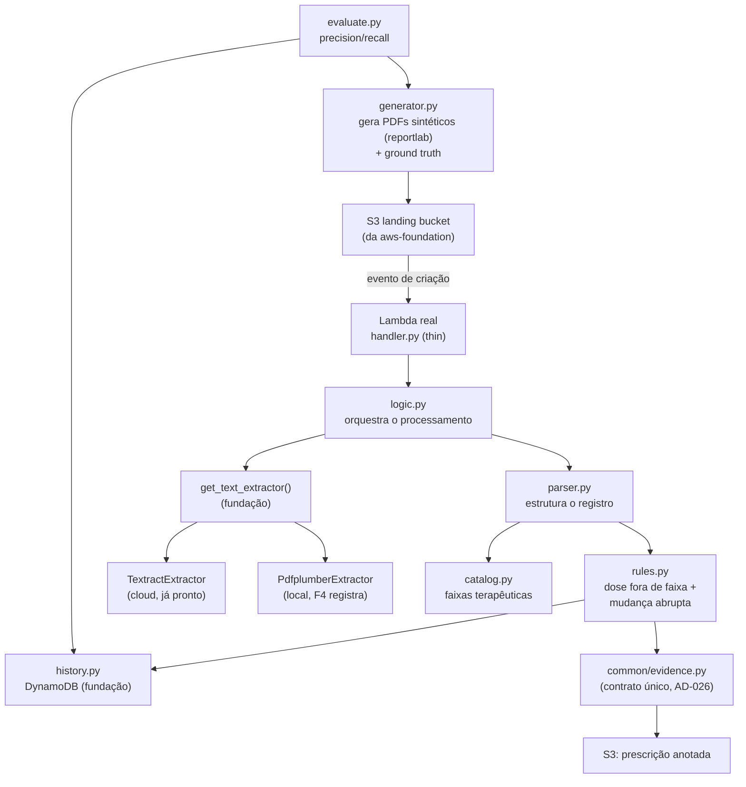

# F4 — Prescription Analysis Design

**Spec**: `.specs/features/prescription-analysis/spec.md`
**Status**: Draft

---

## ⚠️ Reconciliação com a spec original

A spec de F4 foi escrita **antes** da `aws-foundation` existir (AD-034/035/038). Este design
reconcilia os pontos que mudaram, sem reabrir os ACs já aprovados:

| Spec original dizia | Design reconciliado |
| --- | --- |
| "chamar o Textract" (PRESC-03) | Chama `aws.adapters.get_text_extractor()` — resolve **Textract** (cloud, já implementado pela fundação) ou **pdfplumber** (local, **F4 registra aqui**, ver Tech Decisions) |
| "Lambda (role LabRole)" (PRESC-02) | Continua real, mas agora **testável no LocalStack** (Community suporta Lambda — confirmado no health check) sem precisar do Learner Lab. `cloud` só é necessário para a gravação final do vídeo |
| "infraestrutura provisionada por script idempotente" (PRESC-08) | S3/DynamoDB já vêm da fundação (`aws.provision`). **Falta só a função Lambda e o gatilho S3→Lambda**, específicos de F4 — este design os acrescenta em `pipelines/prescription/infra.py`, reaproveitando `get_client` |
| "chave de deduplicação... hash SHA-256" (Assumption, não confirmada) | Trocado pelo **ETag do objeto S3** (já é um hash do conteúdo, fornecido pela AWS automaticamente) + a chave do objeto — evita recalcular hash e ler o arquivo duas vezes (ver Tech Decisions) |

## Decisão de arquitetura confirmada com o usuário

**Lambda real (thin handler) + lógica pura testável separada.** A regra de negócio (parser, regra
de anomalia, persistência) é função Python pura, testável sem AWS. Um handler fino só a invoca. O
handler é implantado de verdade no LocalStack (`create_function` + notificação de bucket S3) e
testado ponta a ponta com evento S3 real — mesmo padrão já usado na `aws-foundation` (thin wrapper
+ infra real, não simulação).

---

## Achados a verificar durante a implementação (não presumir)

| Item | Por quê não presumir agora |
| --- | --- |
| API exata do LocalStack para `create_function` + `put_bucket_notification_configuration` apontando para Lambda | LocalStack Community é conhecido por suportar isso, mas o formato exato do payload/permissões (`add_permission` do Lambda para o S3 invocar) precisa ser confirmado no ambiente real antes de fixar o código de `infra.py` |
| Empacotamento do código da Lambda (zip) | Precisa incluir `logic.py`, `parser.py`, `rules.py`, `history.py`, `catalog.py` e as dependências (`pdfplumber` ou uma camada/layer) — a estratégia exata (zip simples vs. camada) é decisão de implementação, a resolver na Tasks |
| Tamanho do zip do Lambda com `pdfplumber` embutido | `pdfplumber` depende de `pdfminer.six`; verificar se o zip fica dentro do limite do Lambda (250 MB descomprimido) antes de assumir que cabe |

## Achados já verificados (fonte da verdade, não repetir)

- `reportlab` gera PDF com texto real embutido (não é imagem escaneada); `pdfplumber.open(...).pages[0].extract_text()` extrai esse texto de volta, na ordem correta (linha a linha, `\n`-separado) — testado em REPL nesta sessão.
- LocalStack (container local, saudável) reporta `"lambda": "available"` no health check — Lambda real é viável no profile `local`.

---

## Architecture Overview



Duas camadas de teste, mesmo padrão da fundação:
- **Unit**: `logic.py`/`parser.py`/`rules.py`/`catalog.py`/`generator.py` — funções puras, sem AWS.
- **Integration**: `handler.py` implantado de verdade no LocalStack, disparado por um evento S3 real.

---

## Code Reuse Analysis

| Elemento | Origem | Uso |
| --- | --- | --- |
| `aws.clients.get_client` | aws-foundation | Lambda/S3/DynamoDB clients em `infra.py`/`history.py` |
| `aws.adapters.get_text_extractor`/`register_text_extractor` | aws-foundation | F4 consome a interface; registra o adapter **local** |
| `common.evidence.save_evidence`/`evidence_dir` | F3 (AD-026) | Evidência da prescrição anotada, mesmo contrato de F1/F2/F3 |
| `common.metrics.binary_metrics`/`save_report` | F3 | Precision/recall em `evaluate.py` |
| `common.logging.get_logger` | F3 | Log estruturado em todos os módulos novos |
| Padrão idempotente "checar antes de criar" | `aws.provision` (fundação) | `infra.py` reaproveita o mesmo princípio para `ensure_lambda`/`ensure_s3_trigger` |

---

## Components

### `pipelines/prescription/generator.py`

- **Purpose**: Gerar PDFs sintéticos (normais + anômalos) com ground truth conhecido (PRESC-01).
- **Location**: `backend/pipelines/prescription/generator.py`
- **Interfaces**:
  - `generate_prescription(patient_id, drug, dose, frequency, seed) -> bytes` — PDF via `reportlab`
  - `generate_dataset(n, seed, anomaly_rate) -> list[GroundTruthEntry]` — gera o lote + grava o ground truth separado do PDF
- **Dependencies**: `reportlab`
- **Reuses**: `common.logging`

### `pipelines/prescription/catalog.py`

- **Purpose**: Catálogo de faixas terapêuticas de referência (dado estático).
- **Location**: `backend/pipelines/prescription/catalog.py`
- **Interfaces**: `lookup(drug_name: str) -> DrugRange | None`
- **Dependencies**: —
- **Nota**: lista curada de medicamentos comuns com dose mín/máx — **valores ilustrativos a validar
  pelo grupo contra o bulário oficial (ANVISA) antes do relatório final**, conforme já sinalizado na
  spec (Assumption "confirmed: n").

### `pipelines/prescription/adapters.py`

- **Purpose**: `PdfplumberExtractor` (implementação **local** de `TextExtractor`) + registro.
- **Location**: `backend/pipelines/prescription/adapters.py`
- **Interfaces**:
  - `class PdfplumberExtractor: def extract(self, pdf_bytes: bytes) -> ExtractedText` — usa `pdfplumber.open(io.BytesIO(pdf_bytes))`, uma linha por `\n` de `extract_text()`
  - `register_local_adapters() -> None` — `register_text_extractor("local", lambda: PdfplumberExtractor())`
- **Dependencies**: `pdfplumber`
- **Reuses**: `aws.adapters.ExtractedText`, `register_text_extractor`

### `pipelines/prescription/parser.py`

- **Purpose**: Estruturar o registro (medicamento, dose, frequência, paciente, timestamp) a partir do `ExtractedText` (PRESC-04).
- **Location**: `backend/pipelines/prescription/parser.py`
- **Interfaces**: `parse_prescription(extracted: ExtractedText) -> PrescriptionRecord | ParseFailure`
- **Dependencies**: —
- **Reuses**: `ExtractedText` (fundação)
- **Nota**: campo ausente/não numérico → `ParseFailure` explícito ("extração incompleta"), nunca inferido (regra dura da spec).

### `pipelines/prescription/rules.py`

- **Purpose**: As duas regras de anomalia — dose fora de faixa (PRESC-05) e mudança abrupta vs. histórico (PRESC-12/13).
- **Location**: `backend/pipelines/prescription/rules.py`
- **Interfaces**:
  - `check_dose_range(record, catalog) -> AnomalyResult` — "sem referência" se o medicamento não está no catálogo (nunca normal/anômalo por omissão)
  - `check_abrupt_change(record, previous: PrescriptionRecord | None, threshold=0.5) -> AnomalyResult` — `previous=None` (primeiro registro) nunca gera falso positivo
- **Dependencies**: —
- **Reuses**: `catalog.lookup`

### `pipelines/prescription/history.py`

- **Purpose**: Persistência e consulta do histórico do paciente no DynamoDB (PRESC-11).
- **Location**: `backend/pipelines/prescription/history.py`
- **Interfaces**:
  - `dedup_key(bucket, key, etag) -> str` — chave de deduplicação a partir do evento S3 (ver Tech Decisions)
  - `get_latest(patient_id, drug) -> PrescriptionRecord | None` — query DynamoDB por `pk=PATIENT#<id>#DRUG#<drug>`, mais recente por `sk` (timestamp)
  - `save_record(record, dedup_key) -> bool` — `False` se `dedup_key` já existe (idempotência); persiste com `ConditionExpression` para evitar corrida
- **Dependencies**: `aws.clients.get_client("dynamodb")`
- **Reuses**: schema genérico `pk`/`sk` provisionado pela fundação

### `pipelines/prescription/logic.py`

- **Purpose**: Orquestra o processamento de um PDF (o que o handler chama).
- **Location**: `backend/pipelines/prescription/logic.py`
- **Interfaces**: `process(pdf_bytes, bucket, key, etag) -> ProcessResult`
- **Dependencies**: `parser`, `rules`, `history`, `common.evidence`
- **Reuses**: todos os módulos acima

### `pipelines/prescription/handler.py`

- **Purpose**: Handler Lambda **fino** — lê o evento S3, baixa o objeto, chama `logic.process`.
- **Location**: `backend/pipelines/prescription/handler.py`
- **Interfaces**: `lambda_handler(event, context) -> dict`
- **Dependencies**: `logic.process`, `aws.clients.get_client("s3")`
- **Reuses**: `logic.py`
- **Nota**: erro do extractor/Textract → log + move objeto para prefixo `errors/` no S3, não propaga exceção que travaria o lote (PRESC-07).

### `pipelines/prescription/infra.py`

- **Purpose**: Provisiona os recursos **específicos de F4** que a fundação não cobre: a função Lambda e o gatilho S3→Lambda.
- **Location**: `backend/pipelines/prescription/infra.py`
- **Interfaces**:
  - `ensure_lambda(name, zip_bytes, role_arn) -> ProvisionResult` — mesmo padrão checar-antes-de-criar da fundação
  - `ensure_s3_trigger(bucket, function_arn) -> ProvisionResult` — `put_bucket_notification_configuration` + `add_permission`
  - `package_lambda() -> bytes` — empacota `handler.py` + dependências num zip
- **Dependencies**: `aws.clients.get_client`
- **Reuses**: padrão de `aws.provision`

### `pipelines/prescription/evaluate.py`

- **Purpose**: Precision/recall por tipo de anomalia contra o ground truth do gerador (PRESC-10).
- **Location**: `backend/pipelines/prescription/evaluate.py`
- **Interfaces**: `evaluate(ground_truth, dynamodb_records) -> EvaluationReport`
- **Reuses**: `common.metrics.binary_metrics`

---

## Data Models

```python
@dataclass(frozen=True)
class DrugRange:
    name: str
    min_dose: float
    max_dose: float
    unit: str

@dataclass(frozen=True)
class PrescriptionRecord:
    patient_id: str
    drug: str
    dose: float
    unit: str
    frequency: str
    timestamp: str  # ISO-8601, usado como sk no DynamoDB

@dataclass(frozen=True)
class ParseFailure:
    reason: str  # "extração incompleta" + campo específico

@dataclass(frozen=True)
class AnomalyResult:
    kind: str  # "dose_fora_de_faixa" | "mudanca_abrupta" | "sem_referencia" | "normal"
    reason: str

@dataclass(frozen=True)
class GroundTruthEntry:
    patient_id: str
    drug: str
    dose: float
    is_anomalous: bool
    anomaly_type: str | None

@dataclass(frozen=True)
class ProcessResult:
    record: PrescriptionRecord | None
    anomalies: list[AnomalyResult]
    evidence_id: str | None
    deduplicated: bool  # True se o evento já tinha sido processado
```

**Schema DynamoDB** (tabela genérica `pk`/`sk` da fundação):
- `pk = f"PATIENT#{patient_id}#DRUG#{drug}"` — agrupa o histórico do paciente por medicamento
- `sk = timestamp` (ISO-8601) — permite `Query` com `ScanIndexForward=False, Limit=1` para o registro mais recente
- Atributo extra `dedup_key` com `ConditionExpression="attribute_not_exists(dedup_key)"` na escrita, para a idempotência de evento

---

## Error Handling Strategy

| Cenário | Tratamento | Impacto |
| --- | --- | --- |
| Medicamento fora do catálogo | `AnomalyResult(kind="sem_referencia")` — nunca normal/anômalo por omissão | PRESC-14 |
| Campo ausente/não numérico na extração | `ParseFailure` explícito, excluído do cálculo de precision/recall | PRESC-04, edge case |
| Textract/pdfplumber falha (PDF ilegível) | `handler.py` loga no CloudWatch, move objeto para `errors/` no S3, não propaga | PRESC-07 |
| Evento S3 reentregue (mesmo `etag`+`key`) | `history.save_record` detecta via `ConditionExpression`, devolve `deduplicated=True` sem duplicar | PRESC-11 |
| Primeiro registro do paciente/medicamento | `get_latest` devolve `None`; `check_abrupt_change` pula a checagem, nunca falso positivo | PRESC-13 |
| Duas prescrições quase simultâneas do mesmo paciente | Last-write-wins (aceito pela spec); não é o foco de `ConditionExpression` (que protege é a *duplicação de evento*, não a corrida semântica) |

---

## Risks & Concerns

| Concern | Impacto | Mitigação |
| --- | --- | --- |
| **Catálogo de faixas terapêuticas com valores ilustrativos** | Se usados sem validação no relatório final, comprometeriam a credibilidade clínica | Marcado explicitamente como "a validar contra o bulário oficial" — já uma Assumption confirmada com o usuário na spec |
| **Empacotamento do Lambda com `pdfplumber`** (depende de `pdfminer.six`) | Zip pode ficar grande; typo/dependência faltando só aparece no deploy real | `package_lambda()` testado de ponta a ponta contra o LocalStack na T de integração — não presumir que "deveria funcionar" |
| **`put_bucket_notification_configuration` + `add_permission` no LocalStack** | Comportamento pode divergir sutilmente do AWS real | Verificado empiricamente na tarefa de implementação (Achados a verificar), com o teste de integração como prova, não suposição |
| **DynamoDB `Query` presume GSI/chave primária compatível** | Se o schema genérico da fundação (`pk`/`sk` como String) não bater com o que `history.py` espera, a query falha | Schema já é `pk`/`sk` String simples (confirmado no design da fundação) — compatível por construção |

---

## Tech Decisions

| Decisão | Escolha | Rationale |
| --- | --- | --- |
| Geração de PDF sintético | `reportlab` | Texto real embutido (não imagem), maduro, já testado em REPL nesta sessão |
| `TextExtractor` local | `pdfplumber` (não Tesseract) | Os PDFs sintéticos têm texto real embutido — extração direta é mais rápida/precisa que OCR; Tesseract seria necessário só se a entrada fosse imagem escaneada, que não é o caso aqui |
| Chave de deduplicação de evento | ETag do S3 + chave do objeto (não SHA-256 recalculado) | O ETag já é um hash do conteúdo, fornecido pela AWS automaticamente — evita ler o arquivo duas vezes só para hashear |
| Arquitetura do handler | Lambda real (thin) + lógica pura separada | Confirmado com o usuário; mesmo padrão da fundação (thin wrapper + infra real testável) |
| Schema DynamoDB | `pk=PATIENT#<id>#DRUG#<drug>`, `sk=timestamp` | Permite achar "o registro mais recente do mesmo medicamento" (PRESC-12) com uma única `Query`, sem scan |
| Provisionamento da Lambda/gatilho | Módulo próprio de F4 (`infra.py`), reaproveitando `get_client` | A fundação provisiona só recursos genéricos compartilhados (S3/SNS/DynamoDB); a função Lambda é específica de F4 |

> **Nível de projeto:** nenhuma decisão aqui é nova a nível de projeto — todas aplicam AD-034/035/038 já existentes a F4. O padrão "handler fino + lógica pura testável" pode virar convenção para F1/F5 também, mas isso só vira AD se F1/F5 o adotarem de fato.
