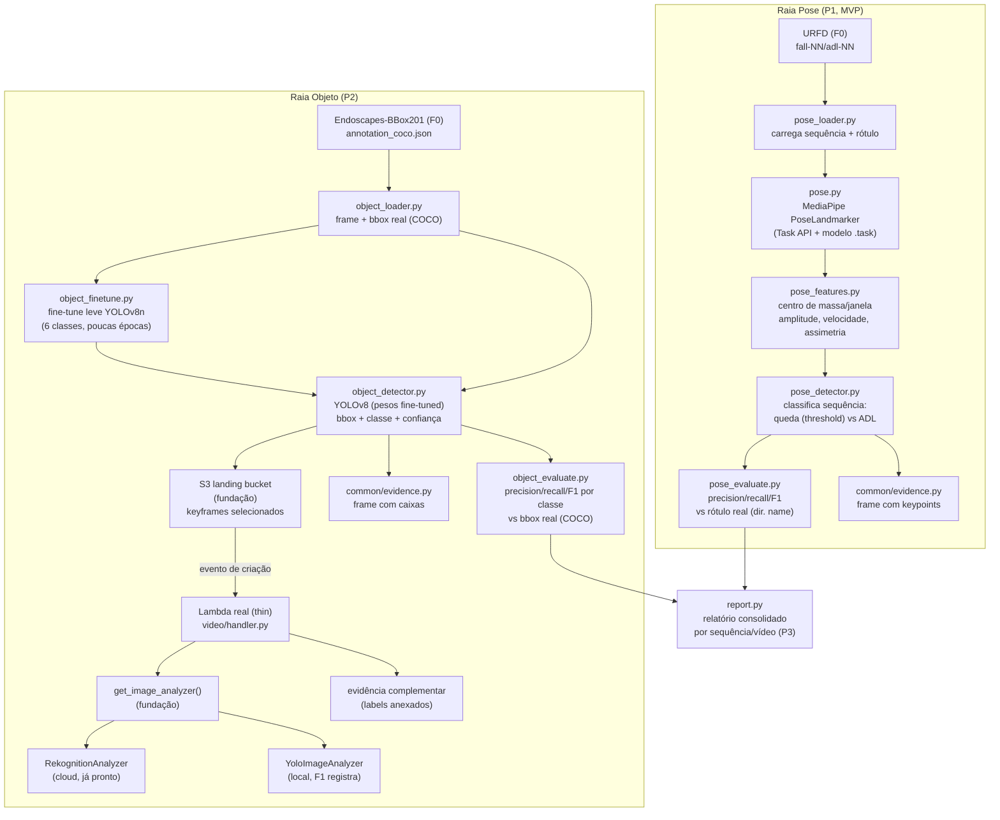

# F1 — Video Analysis Design

**Spec**: `.specs/features/video-analysis/spec.md`
**Status**: Draft

---

## Achados verificados durante o Design (fonte da verdade, não repetir)

Verificados de verdade nesta sessão — instalação real + execução real, não presumidos (Knowledge
Verification Chain):

| Item | Achado |
| --- | --- |
| Layout real do URFD (já baixado por F0) | `data/urfd/<seq>/<seq>-cam0-rgb/<seq>-cam0-rgb-NNN.png`, frames sequenciais numerados. Rótulo = nome do diretório (`fall-NN`/`adl-NN`); **não há** anotação por frame do instante da queda. |
| Layout real do Endoscapes-BBox201 (já baixado por F0) | `data/endoscapes/endoscapes/train\|val\|test/<video>_<frame>.jpg` + `annotation_coco.json` (formato COCO real). 6 categorias: `cystic_plate`, `calot_triangle`, `cystic_artery`, `cystic_duct`, `gallbladder`, `tool`. Split `train`: 1212 imagens, 5566 anotações. |
| API do MediaPipe instalado (`mediapipe==0.10.35`) | A API antiga `mp.solutions.pose` **não existe mais** neste pacote — só `mp.tasks.python.vision.PoseLandmarker` (Task API nova). Exige baixar um modelo `.task` separado (não vem embutido no pip package). |
| Modelo de pose | `pose_landmarker_lite.task` baixado de `storage.googleapis.com/mediapipe-models/pose_landmarker/pose_landmarker_lite/float16/latest/` (5.7 MB, zip válido). Testado com frame real do URFD: **33 landmarks, ~33ms/frame em CPU** — viável para lote (~150-200 frames/sequência × 70 sequências). |
| YOLOv8 (`ultralytics==8.4.104`) | Carrega pesos `yolov8n.pt` pré-treinados (COCO, 80 classes) sem erro. Nenhuma das 6 classes do Endoscapes existe em COCO — modelo genérico não detectaria nada relevante sem fine-tuning. |
| Viabilidade do fine-tuning leve em CPU | Testado de verdade: conversão COCO→formato YOLO (`ultralytics.data.converter.convert_coco`) funciona sobre a anotação real; 1 época sobre 20 imagens reais do Endoscapes levou **~9s em CPU** (imgsz=416, batch=4). Extrapolado para um subconjunto curado (algumas centenas de imagens) e ~15-20 épocas: poucos minutos. **Fine-tuning leve é viável dentro do prazo.** |
| Packaging | Instalar mediapipe/ultralytics atualizou `setuptools`, que passou a recusar autodiscovery em flat-layout (múltiplos dirs top-level). Corrigido com `[tool.setuptools] packages = []` em `pyproject.toml` (o projeto usa `PYTHONPATH=backend`, nunca importa o pacote instalado). |

## Achados a verificar durante a implementação (não presumir agora)

| Item | Por quê não presumir agora |
| --- | --- |
| Threshold exato de variação do centro de massa para "queda" | Precisa calibrar contra o subconjunto real do URFD (mesmo princípio de F3: threshold é decisão de implementação, calibrada empiricamente, não fixada na spec) |
| Quantidade de épocas / tamanho do subconjunto de fine-tuning para uma precision/recall não-trivial | Testado só com 20 imagens/1 época (prova de viabilidade de tempo); a qualidade real da detecção com o subconjunto/épocas definitivos só se confirma rodando de verdade na Tasks |
| Tamanho exato do subconjunto curado do URFD e do Endoscapes para a demo | Trade-off tempo de execução vs. robustez das métricas — decidido durante a implementação, documentado no relatório técnico |

---

## Architecture Overview



Três camadas de teste:
- **Unit**: `pose_loader`/`pose`/`pose_features`/`pose_detector`/`pose_evaluate`/`object_loader`/`object_detector`/`object_evaluate`/`report` — funções puras ou que só chamam MediaPipe/YOLOv8 localmente, sem AWS.
- **Integration (LocalStack real)**: `handler.py`/`infra.py` da raia objeto — mesmo padrão de F4 (Lambda real testado com evento S3 real).
- **Fine-tuning** (`object_finetune.py`): testado com uma execução curta real (poucas imagens/épocas) para confirmar que o pipeline de treino funciona ponta a ponta, não uma avaliação de qualidade de modelo.

---

## Code Reuse Analysis

| Elemento | Origem | Uso |
| --- | --- | --- |
| `aws.clients.get_client` | aws-foundation | Lambda/S3 clients em `infra.py` (raia objeto) |
| `aws.adapters.get_image_analyzer`/`register_image_analyzer` | aws-foundation | F1 consome a interface; registra o adapter **local** (`YoloImageAnalyzer`) |
| `common.evidence.save_evidence`/`evidence_dir` | F3 (AD-026) | Evidência das duas raias, mesmo contrato de F2/F3/F4 |
| `common.metrics.binary_metrics`/`save_report` | F3 | Precision/recall/F1 em `pose_evaluate.py`/`object_evaluate.py` |
| `common.logging.get_logger` | F3 | Log estruturado em todos os módulos novos |
| Padrão idempotente "checar antes de criar" | `aws.provision`/F4 `infra.py` | `video/infra.py` reaproveita o mesmo princípio para `ensure_lambda`/`ensure_s3_trigger` |
| Padrão "Lambda real (thin) + lógica pura testável" | F4 (confirmado com o usuário, AD extensível) | Mesma arquitetura para o complemento cloud da raia objeto |
| Padrão "threshold calibrado empiricamente, não fixado na spec" | F3 (`ABRUPT_CHANGE_THRESHOLD`) | Mesmo princípio para o limiar de queda |

---

## Components

### Raia Pose

#### `pipelines/video/pose_loader.py`
- **Purpose**: Carregar uma sequência do URFD (lista ordenada de frames + rótulo real).
- **Interfaces**: `load_sequence(seq_dir: Path) -> Sequence` — `Sequence(seq_id, label, frame_paths)`; `label` é `"fall"` ou `"adl"`, derivado do nome do diretório.
- **Dependencies**: —

#### `pipelines/video/pose.py`
- **Purpose**: Extrair keypoints de pose por frame via MediaPipe (Task API).
- **Interfaces**:
  - `ensure_pose_model(cache_dir: Path) -> Path` — baixa `pose_landmarker_lite.task` se ausente (idempotente, mesmo princípio de cache de `yolov8n.pt` do ultralytics); nunca falha silenciosamente se o download falhar.
  - `extract_keypoints(frame_path: Path, landmarker) -> PoseFrame | None` — `None` se nenhuma pessoa detectada (edge case VIDEO-13).
- **Dependencies**: `mediapipe`, `opencv-python`

#### `pipelines/video/pose_features.py`
- **Purpose**: Métricas de movimento por janela (VIDEO-02).
- **Interfaces**: `windowed_features(frames: list[PoseFrame | None], window_size: int) -> list[MovementWindow]` — centro de massa (derivado dos landmarks de quadril), amplitude, velocidade, assimetria; janelas sem keypoints suficientes viram `None`/descartadas, nunca inventadas.
- **Dependencies**: `numpy`

#### `pipelines/video/pose_detector.py`
- **Purpose**: Classificar a sequência inteira como queda ou ADL (VIDEO-03).
- **Interfaces**: `classify_sequence(windows: list[MovementWindow], threshold: float) -> SequenceVerdict` — queda se **qualquer** janela exceder o limiar; caso curto demais para uma janela, devolve `"dados_insuficientes"` (VIDEO-14), nunca "ADL" por omissão.
- **Dependencies**: `pose_features`

#### `pipelines/video/pose_evaluate.py`
- **Purpose**: Precision/recall/F1 da raia pose contra o rótulo real (VIDEO-04).
- **Interfaces**: `evaluate(verdicts: list[SequenceVerdict]) -> MetricsReport` — reaproveita `common.metrics.binary_metrics`; sequências "dados_insuficientes" excluídas do cálculo (mesmo princípio de VITALS-10/PRESC-14: indefinido ≠ zero).
- **Reuses**: `common.metrics`

---

### Raia Objeto

#### `pipelines/video/object_loader.py`
- **Purpose**: Carregar frames + anotação COCO real do Endoscapes-BBox201 (VIDEO-06).
- **Interfaces**: `load_annotated_frames(coco_json: Path, images_dir: Path) -> list[AnnotatedFrame]` — `AnnotatedFrame(image_path, boxes: list[BoundingBox])`.
- **Dependencies**: —

#### `pipelines/video/object_finetune.py`
- **Purpose**: Fine-tuning leve do YOLOv8n sobre as 6 classes do Endoscapes.
- **Interfaces**: `finetune(annotated_frames, output_dir, epochs, imgsz) -> Path` — converte para formato YOLO (`ultralytics.data.converter.convert_coco`), treina, devolve o caminho dos pesos resultantes.
- **Dependencies**: `ultralytics`
- **Nota**: execução real, mas leve — não é um pipeline de treino de produção; poucas épocas, subconjunto curado, documentado como tal no relatório técnico.

#### `pipelines/video/object_detector.py`
- **Purpose**: Detecção via YOLOv8 (pesos fine-tuned) — bbox + classe + confiança (VIDEO-07, raia local).
- **Interfaces**: `class YoloDetector: def detect(self, image_path: Path) -> list[Detection]` — `Detection(class_name, confidence, bbox)`.
- **Dependencies**: `ultralytics`

#### `pipelines/video/object_evaluate.py`
- **Purpose**: Precision/recall/F1 por classe contra a anotação COCO real (VIDEO-08).
- **Interfaces**: `evaluate(annotated_frames, detections_by_frame) -> dict[str, MetricsReport]` — casamento detecção↔caixa real por IoU (limiar a definir na implementação); um `MetricsReport` por classe.
- **Reuses**: `common.metrics`

#### `pipelines/video/adapters.py`
- **Purpose**: `YoloImageAnalyzer` — implementação **local** de `ImageAnalyzer` (AD-035), para o complemento cloud (Lambda).
- **Interfaces**:
  - `class YoloImageAnalyzer: def analyze(self, image_bytes: bytes) -> ImageAnalysis` — usa `YoloDetector` internamente, mas expõe só `ImageLabel(name, confidence)` (o contrato existente da fundação não tem bbox — a raia local usa `object_detector.py` diretamente para bbox; o adapter é só para o complemento S3→Lambda).
  - `register_local_adapters() -> None`
- **Reuses**: `aws.adapters.ImageAnalysis`/`ImageLabel`/`register_image_analyzer`, `object_detector.YoloDetector`

#### `pipelines/video/handler.py` + `pipelines/video/infra.py`
- **Purpose**: Complemento cloud — mesma arquitetura de F4 (Lambda real thin + infra própria).
- **Interfaces**: `lambda_handler(event, context) -> dict` (lê evento S3, chama `get_image_analyzer().analyze()`, anexa como evidência complementar); `package_lambda()`/`ensure_lambda()`/`ensure_s3_trigger()` (idênticos em espírito a `pipelines/prescription/infra.py`).
- **Reuses**: `aws.clients.get_client`, padrão de `pipelines/prescription/infra.py`
- **Nota**: falha/limite do Rekognition (VIDEO-10) — log + segue sem propagar, mesmo padrão de PRESC-07.

---

### Consolidação

#### `pipelines/video/report.py`
- **Purpose**: Relatório automático consolidado por sequência/vídeo (P3, VIDEO-11/12).
- **Interfaces**: `generate_report(pose_result, object_result | None) -> str` (Markdown) — sempre gera relatório, mesmo sem eventos ("nenhum evento detectado" explícito).
- **Reuses**: —

---

## Data Models

```python
@dataclass(frozen=True)
class Sequence:
    seq_id: str
    label: str  # "fall" | "adl" -- derivado do nome do diretório
    frame_paths: list[Path]

@dataclass(frozen=True)
class PoseFrame:
    landmarks: list[tuple[float, float, float, float]]  # x, y, z, visibility (33 pontos)

@dataclass(frozen=True)
class MovementWindow:
    start_frame: int
    end_frame: int
    center_of_mass_amplitude: float
    velocity: float
    asymmetry: float

@dataclass(frozen=True)
class SequenceVerdict:
    seq_id: str
    predicted: str  # "queda" | "adl" | "dados_insuficientes"
    label: str      # "fall" | "adl" (rótulo real)

@dataclass(frozen=True)
class BoundingBox:
    class_name: str
    x: float
    y: float
    width: float
    height: float

@dataclass(frozen=True)
class AnnotatedFrame:
    image_path: Path
    boxes: list[BoundingBox]

@dataclass(frozen=True)
class Detection:
    class_name: str
    confidence: float
    bbox: BoundingBox
```

---

## Error Handling Strategy

| Cenário | Tratamento | Impacto |
| --- | --- | --- |
| MediaPipe não detecta pessoa num frame | `extract_keypoints` devolve `None`; frame excluído da janela | VIDEO-13 |
| Sequência curta demais para uma janela | `classify_sequence` devolve `"dados_insuficientes"`, nunca "adl" por omissão | VIDEO-14 |
| YOLOv8 não detecta nada num frame | Lista de detecções vazia, tratado como "nenhuma estrutura visível" | Edge case da spec |
| Rekognition falha/expira/atinge limite (AD-007) | `handler.py` loga e segue, não propaga exceção | VIDEO-10 |
| Duas sequências/vídeos no mesmo lote | IDs/evidências namespaced por `seq_id`, nunca cruzados | VIDEO-15 |
| Keyframe reenviado ao S3 | Dedupe por ETag (mesmo padrão de PRESC-11/F4), nunca duplica label anexado | VIDEO-16 |

---

## Tech Decisions

| Decisão | Escolha | Rationale |
| --- | --- | --- |
| API do MediaPipe | Task API (`vision.PoseLandmarker`) + modelo `.task` baixado sob demanda | A API antiga (`mp.solutions.pose`) não existe na versão instalada — confirmado empiricamente |
| Classificação de queda | Threshold sobre variação do centro de massa numa janela (regra geométrica simples), não um modelo de ML treinado | AD-039 já especifica "variação brusca do centro de massa"; consistente com a natureza do sinal (evento geométrico claro), sem necessidade de um classificador estatístico como em F3 |
| Modelo de objeto | YOLOv8n com fine-tuning leve sobre as 6 classes do Endoscapes-BBox201 | COCO não tem nenhuma das 6 classes; testado empiricamente que um fine-tune leve cabe no prazo em CPU |
| Bounding box no complemento cloud | Não incluída — `ImageAnalyzer` da fundação só expõe `ImageLabel(name, confidence)` | Evita reabrir a interface já fechada da aws-foundation; a raia local (com bbox) já cobre a métrica principal (VIDEO-08), a nuvem é complemento (VIDEO-07) |
| Arquitetura do complemento cloud | Lambda real (thin) + infra própria, mesmo padrão de F4 | Já confirmado com o usuário em F4; reaproveitar o padrão evita uma nova decisão arquitetural |

---

## Risks & Concerns

| Concern | Impacto | Mitigação |
| --- | --- | --- |
| Fine-tuning leve pode gerar métricas fracas para classes raras (ex.: `cystic_artery`) | Relatório técnico deve reportar isso honestamente, não maquiar | Documentar precision/recall reais por classe, mesmo se baixos — consistente com o princípio de dados/resultados reais do projeto |
| Modelo `.task` do MediaPipe requer download externo (não fixo no pip package) | Pipeline falha se não houver rede na primeira execução | `ensure_pose_model` com mensagem de erro clara (mesmo padrão de `make localstack-up` em `aws.provision`) |
| Tamanho do subconjunto curado (URFD e Endoscapes) | Métricas pouco robustas se o subconjunto for pequeno demais | Calibrado durante a implementação, documentado no relatório |

> **Nível de projeto:** nenhuma decisão aqui é nova a nível de arquitetura de projeto — todas aplicam AD-033/035/039 já existentes, e reaproveitam o padrão "Lambda real thin + infra própria" já confirmado em F4.
