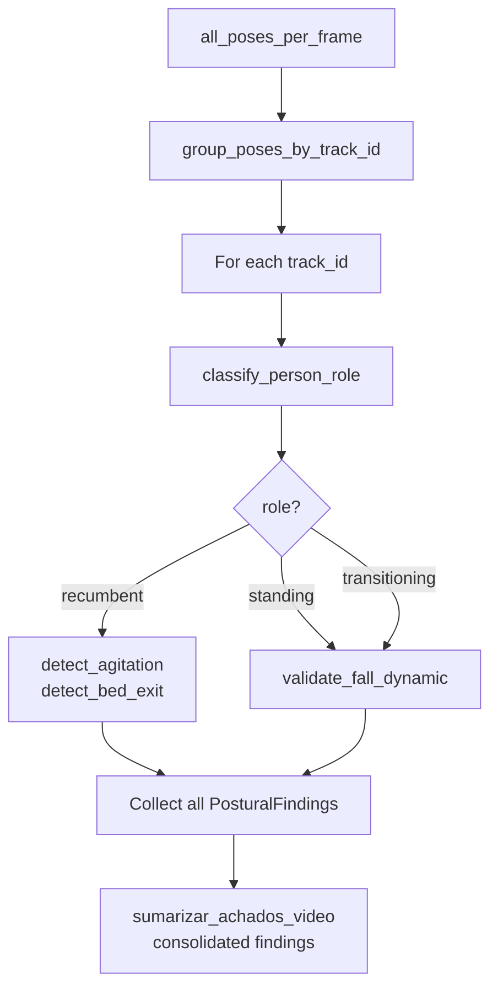

# Video Multi-Person Fix — Iteration 2 Design

**Spec**: `.specs/features/video-multiperson-fix-iter2/spec.md`
**Status**: Draft

---

## Architecture Overview

A Iteração 2 adiciona 5 capacidades ao pipeline de vídeo, organizadas em 3 camadas:

```
┌──────────────────────────────────────────────────────────────────┐
│                    ANALISE.PY (orchestration)                    │
│  classify_person_role() → dispatch detectors by role            │
│  Aggregate findings from ALL tracked persons                    │
└──────────────────────────┬───────────────────────────────────────┘
                           │
┌──────────────────────────▼───────────────────────────────────────┐
│                 POSE_DETECTOR.PY (new detectors)                 │
│  detect_seizure()  detect_agitation()  detect_bed_exit()        │
│  (existing) detect_postural_deviations  detect_trunk_tilt       │
│  (existing) validate_fall_dynamic                               │
└──────────────────────────┬───────────────────────────────────────┘
                           │
┌──────────────────────────▼───────────────────────────────────────┐
│               POSE_FEATURES.PY (feature extraction)              │
│  select_ground_person() ← persistence via dominant_track_id     │
│  classify_person_role()  ← role classifier (new)                │
│  (existing) vertical_velocity_robust, trunk_tilt, is_recumbent  │
│  (existing) group_poses_by_track_id, hip_center                 │
└──────────────────────────────────────────────────────────────────┘
```

Fluxo multi-pessoa após a Iteração 2:



---

## Code Reuse Analysis

### Existing Components to Leverage

| Component | Location | How to Use |
|-----------|----------|------------|
| `PosturalFinding` | `models.py:78` | `finding_type` é `str` — novos tipos ("SEIZURE", "AGITATION", "BED_EXIT") não requerem alteração |
| `group_poses_by_track_id()` | `pose_features.py:401` | Iteração 1 — base para iterar todas as pessoas |
| `is_recumbent()` | `pose_features.py:365` | Iteração 1 — reusado por `classify_person_role()` |
| `hip_center()` | `pose_features.py:157` | Já existe — unificar threshold de 0.5→0.4 |
| `_upper_body_center()` | `pose_features.py:135` | Já existe — fallback para oclusão |
| `joint_angle()` | `pose_features.py:466` | Já existe — reusado por `detect_seizure()` para velocidade angular |
| `dominant_track_id()` | `pose_features.py:376` | Já existe — reusado por A2 para encontrar track_id dominante |
| `validate_fall_dynamic()` | `pose_detector.py:244` | Iteração 1 — reusado sem alteração |
| `sumarizar_achados_video()` | `pose_detector.py:373` | Já existe — estendido para aceitar novos finding_types |
| `reset_person_tracker()` | `pose.py:295` | Padrão existente — estendido para resetar estado de persistência |
| `save_fall_evidence()` / `save_postural_evidence()` | `pose_detector.py` | Mesmo contrato — reusado para novos finding_types |

### Integration Points

| System | Integration Method |
|--------|-------------------|
| `analise._analisar_video_pose` | Passa a iterar `group_poses_by_track_id()` e despachar por `classify_person_role()` |
| `cli.run` (batch driver) | Mesmo padrão — precisa ser atualizado para o novo fluxo multi-pessoa |
| Frontend | Sem alteração — `PosturalFinding.finding_type` já é string livre |

---

## Components

### Component 1: `select_ground_person` — persistência de track_id (A2)

- **Purpose**: Estender `select_ground_person` para manter o mesmo track_id ao longo da sequência, eliminando saltos de identidade.
- **Location**: `backend/pipelines/video/pose_features.py` (modificação da função existente)
- **Interfaces**:
  - `select_ground_person(all_poses) -> tuple[list[PoseFrame | None], list[int | None]]` — mesma assinatura; comportamento interno muda
  - Estado do módulo: `_ground_person_state: dict` (track_id dominante + frames desde última aparição)
  - `reset_ground_person_state()` — novo, chamado por `reset_person_tracker()`
- **Dependencies**: `dominant_track_id()` (existente), `group_poses_by_track_id()` (Iteração 1)
- **Reuses**: Padrão de estado do módulo (`_tracker_state` em `pose.py:278`)

**Algoritmo**:
1. Calcular `group_poses_by_track_id(all_poses)` para ter timelines por track_id
2. Nos primeiros 60 frames, contar qual track_id aparece com maior Y médio → `dominant_tid`
3. Para cada frame, se `dominant_tid` está presente → usar essa pose (ignorar outras)
4. Se `dominant_tid` ausente por > 30 frames consecutivos → recalcular
5. Se não há tracking (todos None) → fallback ao comportamento original (Y máximo por frame)

**Design decision — stateful vs pure**:

| Approach | Pros | Cons | Choice |
|----------|------|------|--------|
| **A) Stateful** — estado no módulo (`_ground_person_state`) | Segue padrão existente (`_tracker_state`); não quebra callers | Estado global; precisa de `reset_` | ✅ Escolhido |
| B) Pure — `dominant_tid` como parâmetro de entrada/saída | Sem estado global; testável isoladamente | Quebra assinatura; todos os callers precisam mudar | ❌ |

### Component 2: `classify_person_role()` — classificador de papel (A3)

- **Purpose**: Classificar uma pessoa como "recumbent", "standing" ou "transitioning" com base na posição Y.
- **Location**: `backend/pipelines/video/pose_features.py` (nova função)
- **Interfaces**:
  - `classify_person_role(person_frames: list[PoseFrame | None]) -> str` — devolve "recumbent" | "standing" | "transitioning" | "unknown"
- **Dependencies**: `is_recumbent()` (Iteração 1), `hip_center()`
- **Reuses**: `is_recumbent()` para a classe "recumbent"

**Algoritmo**:
1. Se `is_recumbent(person_frames)` → "recumbent"
2. Calcular Y médio dos últimos 30 frames válidos via `hip_center()`
3. Se Y médio < 0.35 → "standing"
4. Caso contrário → "transitioning"
5. Se < 10 frames válidos no total → "unknown"

### Component 3: `detect_seizure()` — detector de convulsão (B2)

- **Purpose**: Detetar oscilação rítmica multi-articular indicativa de convulsão/espasmo.
- **Location**: `backend/pipelines/video/pose_detector.py` (nova função)
- **Interfaces**:
  - `detect_seizure(frames: list[PoseFrame | None], fps: float, window_frames: int = 60, min_std: float = 0.05, persistence_frames: int = 30) -> list[PosturalFinding]`
- **Dependencies**: `joint_angle()` (existente)
- **Reuses**: Padrão de streak de `detect_postural_deviations()`

**Algoritmo**:
1. Para cada frame, calcular ângulo de 4 articulações: cotovelo E (11-13-15), cotovelo D (12-14-16), joelho E (23-25-27), joelho D (24-26-28)
2. Calcular velocidade angular: `|angle_frame_N - angle_frame_N-1|`
3. Janela deslizante de 60 frames: `std(velocidades)` para cada articulação
4. Média das 4 stds → se > 0.05 por 30+ frames consecutivos → finding "SEIZURE"
5. `measured_angle` = std média; `expected_angle` = min_std; `score` = min(1.0, std/max_std)

### Component 4: `detect_agitation()` — detector de agitação (B2)

- **Purpose**: Detetar mudanças frequentes de posição indicativas de agitação psicomotora.
- **Location**: `backend/pipelines/video/pose_detector.py` (nova função)
- **Interfaces**:
  - `detect_agitation(frames: list[PoseFrame | None], fps: float, window_frames: int = 30, min_changes_per_minute: int = 10, min_total_frames: int = 120) -> list[PosturalFinding]`
- **Dependencies**: `hip_center()`
- **Reuses**: Nenhum — padrão novo (contagem de eventos por minuto)

**Algoritmo**:
1. Dividir timeline em janelas de 30 frames
2. Calcular Y médio dos quadris em cada janela (via `hip_center`, fallback `_upper_body_center`)
3. Mudança = `|Y_medio_janela_N - Y_medio_janela_N-1| > 0.03`
4. Taxa = mudanças / (total_frames / fps) * 60
5. Se taxa > 10 → finding "AGITATION"
6. `measured_angle` = taxa; `expected_angle` = 10; `score` = min(1.0, taxa/20)

### Component 5: `detect_bed_exit()` — detector de saída do leito (B2)

- **Purpose**: Detetar movimento sustentado de subida + deslocamento lateral em pessoa previamente deitada.
- **Location**: `backend/pipelines/video/pose_detector.py` (nova função)
- **Interfaces**:
  - `detect_bed_exit(frames: list[PoseFrame | None], fps: float, window_frames: int = 60, min_delta_y: float = -0.10, min_delta_x: float = 0.05, min_total_frames: int = 120) -> list[PosturalFinding]`
- **Dependencies**: `hip_center()`, `lateral_displacement()` (existente)
- **Reuses**: `lateral_displacement()` já calcula ΔX por frame

**Algoritmo**:
1. Só aplicável se `is_recumbent(frames)` — caso contrário, devolve []
2. Calcular Y médio dos últimos 30 frames vs. 30 frames anteriores (janela de 60 frames total)
3. Calcular deslocamento lateral total nos mesmos 60 frames via `lateral_displacement()`
4. Se ΔY < -0.10 E ΔX > 0.05 → finding "BED_EXIT"
5. `measured_angle` = |ΔY|; `expected_angle` = 0.10; `score` = min(1.0, |ΔY|/0.20)

### Component 6: `_MIN_VISIBILITY` unificado (B3)

- **Purpose**: Reduzir threshold único de visibilidade de 0.5 para 0.4.
- **Location**: `backend/pipelines/video/pose_features.py` (constante existente)
- **Interfaces**: Substituir `_MIN_VISIBILITY = 0.5` e `_MIN_OCCLUSION_VIS = 0.4` por uma única constante `_MIN_VISIBILITY = 0.4`
- **Dependencies**: Nenhuma — é uma constante
- **Reuses**: N/A — é uma alteração de valor

### Component 7: `_MIN_CONSECUTIVE_FRAMES` reduzido (C1)

- **Purpose**: Reduzir o requisito de frames consecutivos no filtro temporal de `select_ground_person`.
- **Location**: `backend/pipelines/video/pose_features.py` (constante inline → constante nomeada)
- **Interfaces**: Extrair o valor 3 como constante `_MIN_CONSECUTIVE_FRAMES = 2` e usar no filtro de streak
- **Dependencies**: Nenhuma
- **Reuses**: N/A

---

## Data Models

Sem novos dataclasses. `PosturalFinding` existente cobre todos os novos finding_types:

```
PosturalFinding(
    finding_type="SEIZURE",       # novo
    joint_name=None,              # não aplicável
    measured_angle=0.087,         # std média das velocidades angulares
    expected_angle=0.05,          # min_std
    duration_s=2.5,               # duração da streak
    frame_index=145,              # frame inicial da streak
    score=0.72,                   # 0–1 normalizado
    description="Convulsão/espasmo detectado (std=0.087, 4 articulações, 2.5s)."
)

PosturalFinding(
    finding_type="AGITATION",     # novo
    joint_name=None,
    measured_angle=15.0,          # mudanças/min
    expected_angle=10.0,          # threshold
    duration_s=60.0,              # período analisado
    frame_index=0,
    score=0.75,
    description="Agitação psicomotora detectada (15 mudanças/min, threshold 10)."
)

PosturalFinding(
    finding_type="BED_EXIT",      # novo
    joint_name=None,
    measured_angle=0.15,          # |ΔY|
    expected_angle=0.10,          # threshold
    duration_s=3.0,               # duração do movimento
    frame_index=200,
    score=0.75,
    description="Saída do leito detectada (ΔY=0.15, ΔX=0.08, 3.0s)."
)
```

---

## Error Handling Strategy

| Error Scenario | Handling | User Impact |
|---------------|----------|-------------|
| Timeline vazia (todos None) em `classify_person_role` | Devolve "unknown" | Pessoa ignorada nessa sequência |
| < 10 frames válidos em detector | Devolve lista vazia | Sem finding (dados insuficientes) |
| Articulação com visibilidade < 0.4 em `detect_seizure` | Exclui essa articulação do frame; não invalida o frame | Deteção funciona com as articulações visíveis |
| Tracking não disponível (todos track_id=None) | Fallback ao comportamento Iteração 1 (single-person) | Retrocompatibilidade total |
| `dominant_track_id` não encontrado nos primeiros 60 frames | Fallback ao comportamento original (Y máximo por frame) | Sem persistência, mas sem erro |

---

## Risks & Concerns

| Concern | Location (file:line) | Impact | Mitigation |
|---------|---------------------|--------|------------|
| `select_ground_person` já tem lógica complexa (filtro temporal + scoring + seleção) | `pose_features.py:291-351` | Adicionar persistência pode tornar a função difícil de testar isoladamente | Extrair a lógica de persistência para uma função auxiliar `_persist_ground_person()` testável independentemente |
| `detect_seizure` depende de 4 chamadas a `joint_angle()` por frame | `pose_features.py:466` | Custo computacional: 4 ângulos × N frames × 3 landmarks = 12N operações | Usar `joint_angles_per_frame()` (já existente) para batch; pré-calcular ângulos uma vez |
| `PosturalFinding` usa `measured_angle`/`expected_angle` para novos detectores que não medem ângulos | `models.py:82-83` | Semântica confusa: "agitação" não tem ângulo | Documentar no campo `description`; os nomes `measured_angle`/`expected_angle` são mantidos por retrocompatibilidade do dataclass |
| `sumarizar_achados_video` não reconhece os novos finding_types | `pose_detector.py:373` | Achados de convulsão/agitação/saída não aparecem no resumo clínico | Estender a função para incluir os novos tipos no resumo |
| Testes existentes de `select_ground_person` podem quebrar com a persistência | `test_pose_features.py:244-313` | Regressão em 6 testes | A persistência só é ativada quando há track_ids múltiplos; testes single-person e sem tracking não são afetados |

---

## Tech Decisions

| Decision | Choice | Rationale |
|----------|--------|-----------|
| Persistência de track_id: estado no módulo vs parâmetro | Estado no módulo (`_ground_person_state`) | Segue o padrão `_tracker_state` em `pose.py`; não quebra assinatura |
| Pipeline multi-pessoa: expandir existente vs nova função wrapper | Nova função `analyze_all_persons()` em `pose_detector.py` | Não quebra `select_ground_person`; separação clara de responsabilidades |
| `detect_seizure`: quais articulações | Cotovelos (13,14) + joelhos (25,26) — 4 articulações | Cobre membros superiores e inferiores; mesma abordagem de `joint_angle()` existente |
| `detect_agitation`: tamanho da janela | 30 frames (~1s a 30fps) | Janela curta o suficiente para capturar mudanças rápidas; longa o suficiente para não disparar com tremor |
| `detect_bed_exit`: gate de `is_recumbent` | Só executa se `is_recumbent=True` | Específico para pessoa deitada; evita falso positivo em pessoa de pé que se desloca |
| Threshold de visibilidade unificado | 0.4 | Já validado como `_MIN_OCCLUSION_VIS`; cobre lençóis/cobertores |
| Streak mínimo | 2 frames | Ainda filtra ruído de 1 frame; captura eventos breves |
