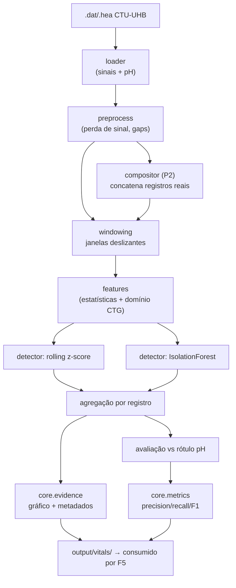

# F3 — Vitals Anomaly Design

**Spec**: `.specs/features/vitals-anomaly/spec.md`
**Status**: Draft

---

## Achados da pesquisa (verificados)

Verificado diretamente na fonte (PhysioNet) antes de desenhar:

| Fato | Valor | Impacto no design |
| --- | --- | --- |
| Formato | WFDB — par `.dat` (binário) + `.hea` (texto) | Leitura via biblioteca `wfdb` (AD-016) |
| Volume | 552 registros, até 90 min cada | Subconjunto curado é suficiente (assumption já confirmada na spec) |
| Sinais | `FHR` (freq. cardíaca fetal) e `UC` (contração uterina) | Entrada bivariada para o IsolationForest |
| Taxa de amostragem | **4 Hz em todos os registros** | Simplifica VITALS-07: o resample vira defensivo, não rotineiro |
| pH | Comentário no `.hea`: `#pH           7.26` | Parser de comentários com regex `#pH\s+([\d.]+)` |
| Outros desfechos | `BDecf`, `BE`, `pCO2`, `Apgar1`, `Apgar5` no mesmo formato | Disponíveis como rótulos alternativos, se o pH sozinho for fraco |

**API do `wfdb` — VERIFICADA** (wfdb 4.3.1, confirmado no REPL em 2026-07-20, não presumido):

| Atributo do `Record` | Uso em F3 |
| --- | --- |
| `p_signal` | matriz de sinais em unidades físicas (colunas = canais) |
| `sig_name` | nomes dos canais — localizar `FHR` e `UC` por nome, nunca por índice fixo |
| `fs` | taxa de amostragem (4.0 no CTU-UHB) |
| `comments` | linhas de comentário do `.hea` — fonte do pH. **O `wfdb` remove o `#` inicial**: a linha chega como `'pH           7.26'`. Verificado em REPL — presumir o `#` faria a regex nunca casar e descartaria 100% dos registros silenciosamente |
| `sig_len`, `n_sig`, `record_name` | validação e identificação |

`wfdb.rdrecord(record_name, sampfrom, sampto, channels, physical, pn_dir)` — a leitura parcial por
`sampfrom`/`sampto` existe e pode ser usada se a memória for um problema com registros longos.

---

## Architecture Overview

Pipeline local em estágios, cada um com entrada/saída explícita e testável isoladamente. O núcleo
compartilhado (`core/`) é estabelecido aqui e reutilizado por F1, F2, F4 e F5.



---

## Code Reuse Analysis

Projeto greenfield — não há código existente para reutilizar. **F3 estabelece** o pacote `core/`
que as demais features consomem. Cada componente abaixo marcado como `core/` é escrito de forma
genérica (sem acoplamento a CTG/sinais vitais) porque F1, F2, F4 e F5 dependerão dele.

| Componente de `core/` | Estabelecido por | Consumido depois por |
| --- | --- | --- |
| `core/evidence.py` — formato único de evidência | F3 | F1 (frame anotado), F2 (espectrograma), F4 (PDF anotado), F5 (drill-down) |
| `core/metrics.py` — precision/recall/F1 | F3 | F1, F2, F4 (todas reportam contra ground truth) |
| `core/config.py` — carga de config declarativa | F3 | todas |
| `core/logging.py` — log estruturado | F3 | todas |
| `core/aws.py` — cliente boto3 com `LabRole` | **F4** (F3 não usa AWS) | F1, F5 |

> Nota de sequenciamento: `core/aws.py` **não** entra em F3 (Out of Scope da spec: "integração direta com AWS"). Ele é criado em F4, que é a próxima feature do plano de 7 dias.

---

## ⚠️ Decisão de design central: granularidade do rótulo

**Este é o ponto que decide as métricas de F3 e a spec não o resolve.**

O rótulo (pH) é **um por registro** — um único valor para até 90 minutos de sinal. Os detectores
operam **por janela** — dezenas ou centenas de classificações por registro. Comparar os dois exige
uma regra de agregação explícita, e essa regra determina inteiramente precision/recall (VITALS-05).

Regra adotada: **fração de janelas anômalas acima de um limiar**.

```
registro classificado como patológico  ⟺  (nº janelas anômalas / nº janelas válidas) > τ
```

`τ` é configurável (default inicial: 0.15) e calibrado sobre um conjunto de desenvolvimento
separado do conjunto de avaliação — nunca calibrado no mesmo conjunto onde as métricas finais são
reportadas, o que inflaria artificialmente o resultado.

**Alternativa descartada:** "qualquer janela anômala ⇒ registro patológico". Rejeitada porque em
séries de 90 min a 4 Hz (≈21.600 amostras) praticamente todo registro teria ao menos um outlier,
levando a recall ≈ 1.0 e precision ≈ taxa de prevalência — uma métrica sem poder discriminativo.

---

## Components

### `core/evidence.py`

- **Purpose**: Formato único de evidência para todas as features do projeto.
- **Location**: `src/core/evidence.py`
- **Interfaces**:
  - `save_evidence(event: AnomalyEvent, artifact_path: Path) -> Evidence` — persiste metadados + caminho do artefato visual
  - `evidence_dir(feature: str, run_id: str) -> Path` — convenção de diretório de saída
- **Dependencies**: nenhuma externa (só stdlib + pydantic/dataclass)
- **Reuses**: —

### `core/metrics.py`

- **Purpose**: Cálculo e serialização de precision/recall/F1 contra ground truth.
- **Location**: `src/core/metrics.py`
- **Interfaces**:
  - `binary_metrics(y_true: list[bool], y_pred: list[bool]) -> MetricsReport`
  - `save_report(report: MetricsReport, path: Path) -> None` — grava JSON/CSV
- **Dependencies**: `scikit-learn` (ou cálculo manual, decidido em Tasks)
- **Reuses**: —

### `vitals/loader.py`

- **Purpose**: Ler um registro CTU-UHB (sinais + pH) e validá-lo.
- **Location**: `src/vitals/loader.py`
- **Interfaces**:
  - `load_record(record_path: Path) -> VitalRecord` — lança `InvalidRecordError` se sinal ou pH ausente/não numérico
  - `parse_ph(comments: list[str]) -> float | None` — regex sobre os comentários do `.hea`
  - `load_dataset(dir: Path) -> tuple[list[VitalRecord], list[LoadFailure]]` — descarta inválidos sem interromper o lote (VITALS-08)
- **Dependencies**: `wfdb`
- **Reuses**: `core/logging.py`

### `vitals/preprocess.py`

- **Purpose**: Tratar perda de sinal e gaps antes da detecção.
- **Location**: `src/vitals/preprocess.py`
- **Interfaces**:
  - `mark_signal_loss(signal: np.ndarray) -> np.ndarray` — máscara booleana de amostras inválidas (zeros/dropout)
  - `interpolate_gaps(signal, mask, max_gap_s: float) -> np.ndarray` — interpola gaps curtos; gaps longos permanecem marcados como inválidos
- **Dependencies**: `numpy`
- **Reuses**: —

### `vitals/windowing.py`

- **Purpose**: Fatiar a série em janelas deslizantes, preservando ordem cronológica (VITALS-10).
- **Location**: `src/vitals/windowing.py`
- **Interfaces**:
  - `make_windows(record: VitalRecord, size_s: float, stride_s: float) -> list[Window]` — janelas com fração de amostras inválidas acima do limite são marcadas `insufficient_data` (VITALS-09)
- **Dependencies**: `numpy`
- **Reuses**: —

### `vitals/features.py`

- **Purpose**: Extrair o vetor de features por janela.
- **Location**: `src/vitals/features.py`
- **Interfaces**:
  - `extract(window: Window) -> FeatureVector` — estatísticas (média, desvio, min/max) + features de domínio CTG: baseline FHR, variabilidade de curto prazo, contagem de decelerações
- **Dependencies**: `numpy`
- **Reuses**: —

### `vitals/detectors.py`

- **Purpose**: Os dois detectores exigidos pela spec, atrás de uma interface comum.
- **Location**: `src/vitals/detectors.py`
- **Interfaces**:
  - `class Detector(Protocol): def score(self, windows: list[FeatureVector]) -> list[float]`
  - `RollingZScoreDetector(threshold: float)` — baseline univariado sobre FHR (VITALS-03)
  - `IsolationForestDetector(contamination: float, seed: int)` — multivariado FHR+UC (VITALS-04); `seed` fixa para reprodutibilidade
- **Dependencies**: `numpy`, `scikit-learn`
- **Reuses**: —

### `vitals/aggregate.py`

- **Purpose**: Aplicar a regra de agregação janela → registro (ver decisão central acima).
- **Location**: `src/vitals/aggregate.py`
- **Interfaces**:
  - `aggregate(window_flags: list[bool | None], tau: float) -> RecordVerdict` — janelas `None` (dados insuficientes) são excluídas do denominador, não contadas como normais
- **Dependencies**: —
- **Reuses**: —

### `vitals/compositor.py` (P2)

- **Purpose**: Montar a timeline de demo concatenando registros reais (VITALS-07).
- **Location**: `src/vitals/compositor.py`
- **Interfaces**:
  - `compose(spec: TimelineSpec) -> VitalRecord` — concatena na ordem declarada, com timestamps contínuos e sem sobreposição; preserva `provenance` por trecho
  - `_ensure_uniform_rate(records) -> None` — valida que todos são 4 Hz; só resampla se divergirem (defensivo)
- **Dependencies**: `numpy`
- **Reuses**: `vitals/loader.py`

### `vitals/cli.py`

- **Purpose**: Ponto de entrada único (`make demo` chama isto).
- **Location**: `src/vitals/cli.py`
- **Interfaces**:
  - `run(config_path: Path) -> int` — executa loader → detect → evaluate → evidence e grava tudo em `output/vitals/`
- **Dependencies**: todos os acima
- **Reuses**: `core/config.py`, `core/evidence.py`, `core/metrics.py`

---

## Data Models

```python
@dataclass(frozen=True)
class VitalRecord:
    record_id: str
    fhr: np.ndarray            # 4 Hz
    uc: np.ndarray             # 4 Hz
    fs: float                  # 4.0
    ph: float | None           # None só em registros descartados
    provenance: list[Segment]  # 1 item para registro simples; N para timeline composta

@dataclass(frozen=True)
class Segment:
    source_record_id: str
    start_idx: int
    end_idx: int

@dataclass(frozen=True)
class Window:
    record_id: str
    start_s: float
    end_s: float
    fhr: np.ndarray
    uc: np.ndarray
    insufficient_data: bool

@dataclass(frozen=True)
class AnomalyEvent:
    record_id: str
    detector: str              # "zscore" | "isolation_forest"
    start_s: float
    end_s: float
    score: float
    source_record_id: str      # proveniência na timeline composta (VITALS-07)

@dataclass(frozen=True)
class RecordVerdict:
    record_id: str
    predicted_pathological: bool
    anomalous_fraction: float
    n_windows_valid: int
    n_windows_excluded: int

@dataclass(frozen=True)
class MetricsReport:
    detector: str
    precision: float
    recall: float
    f1: float
    support: int
```

**Ground truth**: `is_pathological = ph < 7.05` (VITALS-02), computado no loader e nunca no detector — os detectores são não supervisionados e não devem enxergar o rótulo.

---

## Error Handling Strategy

| Cenário | Tratamento | Impacto |
| --- | --- | --- |
| `.hea` sem pH ou não numérico | Registro descartado do lote, log de aviso (VITALS-08) | Não entra nas métricas; contagem de descartes reportada |
| `.dat` corrompido / ilegível | Idem acima, `LoadFailure` acumulado | Lote continua |
| Janela com excesso de perda de sinal | Marcada `insufficient_data`, excluída do denominador (VITALS-09) | Não vira falso negativo silencioso |
| Nenhum registro patológico no subconjunto | Aviso explícito antes de reportar métricas (VITALS-10 da spec) | Usuário sabe que recall é indefinido, não zero |
| Registros com fs divergente na composição | Resample defensivo + log | Timeline permanece contínua |

---

## Risks & Concerns

| Concern | Impacto | Mitigação |
| --- | --- | --- |
| **Detectores não supervisionados podem não correlacionar com pH.** z-score e IsolationForest encontram outliers estatísticos; o pH mede acidose fetal. Não há garantia de que uma coisa preveja a outra — as métricas podem sair fracas. | Métricas de P1 ruins comprometem o argumento central do relatório | (1) Incluir features de domínio CTG (baseline, variabilidade, decelerações) em vez de só estatísticas brutas — é o que a literatura clínica associa a sofrimento fetal; (2) tratar métrica fraca como **achado honesto a reportar**, não como falha a esconder — o relatório discute a limitação. Isso está alinhado com AD-015 (métricas honestas). |
| **Perda de sinal é endêmica em CTG.** Registros de FHR têm dropout (zeros) por deslocamento do transdutor. Se tratado como valor real, gera outlier espúrio. | Falsos positivos massivos, métricas sem sentido | `preprocess.py` marca e exclui explicitamente antes da detecção; janelas muito degradadas viram `insufficient_data` |
| **Desbalanceamento de classes.** pH < 7.05 é minoria no CTU-UHB. | Acurácia enganosa; um classificador trivial "tudo normal" pontuaria bem | Reportar precision/recall/F1 por classe (nunca acurácia global); documentar a prevalência real no relatório |
| **Calibração de `τ` e limiares no mesmo conjunto de avaliação** | Métricas infladas, não reproduzíveis | Separação explícita dev/avaliação; a tarefa de calibração não pode tocar o conjunto de avaliação |
| **API do `wfdb` não verificada** (nomes de atributos) | Parser quebra na primeira execução | Primeira tarefa de implementação confirma a API na documentação/REPL antes de escrever o loader |

---

## Tech Decisions

| Decisão | Escolha | Rationale |
| --- | --- | --- |
| Agregação janela → registro | Fração de janelas anômalas > `τ` (default 0.15) | Ver decisão central acima; alternativa "qualquer janela" não discrimina |
| Features do detector | Estatísticas + features de domínio CTG | Mitiga o risco de correlação fraca com pH |
| Interface dos detectores | `Protocol` comum com `score()` | Permite adicionar MIT-BIH (P3) e trocar detectores sem mudar o pipeline |
| Janelas com dados insuficientes | Excluídas do denominador (não contadas como normais) | Evita falso negativo silencioso mascarando a taxa real |
| Reprodutibilidade | `seed` explícita no IsolationForest; config declarativa versionada | Exigência de determinismo (VITALS-07 / spec) |
| `core/aws.py` fora de F3 | Criado em F4 | F3 é 100% local por Out of Scope da spec |

> **Nível de projeto:** a estrutura do monorepo (`src/core` + módulo por feature) e o formato único de evidência são convenções que F1/F2/F4/F5 seguem — devem ser registradas como AD no `STATE.md` ao aprovar este design.
