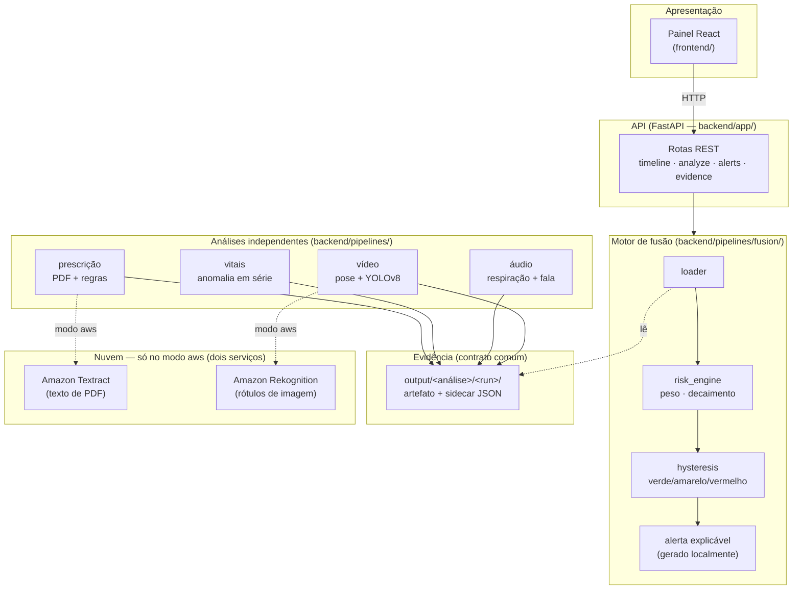

# Monitoramento Hospitalar Multimodal

Sistema que combina quatro fontes de dados de um paciente — **vídeo, áudio, sinais
vitais e prescrições médicas** — para gerar um indicador único de risco e alertar a
equipe automaticamente quando algo preocupante é detectado.

> Tech Challenge — Fase 4 (POSTECH 8IADT). O enunciado completo do desafio está em
> [`docs/8IADT-Fase-4-Tech-challenge.md`](docs/8IADT-Fase-4-Tech-challenge.md); o
> relatório técnico com resultados e decisões de projeto está em
> [`docs/relatorio-tecnico.md`](docs/relatorio-tecnico.md).

---

## O que o sistema faz

| Modalidade | O que analisa | Técnica / modelo |
| --- | --- | --- |
| **Vídeo — movimentação** | Postura, quedas (com filtro dinâmico de velocidade), desvios posturais, ângulos articulares, inclinação de tronco | MediaPipe Pose + YOLOv8n (crop de pessoa) + filtro temporal $V_y$ anti-falso-positivo |
| **Vídeo — cirurgia** | Estruturas anatômicas críticas em vídeo cirúrgico (keyframes a cada 2s) | YOLOv8 fine-tuned (Endoscapes) com evidência anotada (bboxes) |
| **Áudio** | Sons respiratórios (com anotação ICBHI) ou consultas (transcrição, termos críticos, fadiga vocal) — dispatch automático | Random Forest + faster-whisper + Parselmouth (jitter/shimmer/HNR) |
| **Sinais vitais** | Séries temporais: cardiotocografia fetal (CTU-UHB) e internação adulta com HR/SpO2 (BIDMC) | z-score móvel + Isolation Forest sobre janelas |
| **Prescrições** | Lê receitas em PDF, verifica dose fora da faixa e variação abrupta; geração avulsa de prescrições sintéticas | Extração de texto (pdfplumber/Textract) + regras clínicas + gerador standalone |
| **Fusão e alerta** | Combina as análises num indicador de risco (verde/amarelo/vermelho) com alerta explicável local | Late fusion ponderada com decaimento temporal + histerese |
| **Painel** | Pacientes, envios, linha do tempo de risco, alertas e drill-down de evidência | React + Vite sobre a API |

**Princípio central — evidência sempre reproduzível.** Cada anomalia detectada gera um
artefato (imagem anotada, trecho de áudio, gráfico da janela, PDF marcado) junto de um
descritor `JSON`. O sistema nunca aponta um risco sem mostrar o porquê — e essa
evidência é a única "cola" entre as análises e a camada de fusão.

---

## Arquitetura

O sistema é organizado em camadas, cada uma consumindo apenas a de baixo por um
contrato explícito. As quatro análises são **independentes** entre si (não se importam
umas às outras); o único ponto de contato é o **arquivo de evidência** que cada uma
grava em `output/<análise>/<execução>/`, e que a fusão depois lê.



**Fluxo de dados**: cada arquivo enviado a um paciente é analisado pelo pipeline da sua
modalidade, que grava evidência real em disco; o resultado (achado em linguagem clínica
+ pontuação + evidência) fica no banco local. O motor de fusão carrega os achados do
paciente, calcula um risk score por janela de tempo (soma ponderada com decaimento
exponencial), classifica em verde/amarelo/vermelho com histerese e, ao cruzar o limiar
de disparo, gera um alerta explicável **localmente** (registrado no banco e exibido pela
interface — não há envio por serviço de notificação). A API expõe esse resultado; o
painel só consome a API por HTTP. As análises são 100% locais; só o modo `aws` chama
dois serviços gerenciados (Textract para PDF, Rekognition para imagem), com o resultado
voltando ao processamento local.

### Estrutura de pastas

```
backend/
├── app/          API REST (FastAPI) + banco local de pacientes (SQLite): pacientes,
│                 envios de arquivo, análises, linha do tempo de risco e alertas
├── common/       Compartilhado: contrato de evidência, métricas, config, log
├── pipelines/
│   ├── video/        Postura (MediaPipe) + detecção de objetos (YOLOv8)
│   ├── audio/        Respiração (ICBHI), transcrição, termos críticos, fadiga vocal
│   ├── vitals/       Detecção de anomalia em séries temporais de sinais vitais
│   ├── prescription/ Leitura de PDF + regras de dose
│   └── fusion/       Motor de fusão de risco + alerta explicável (local)
├── aws/          Modo aws: só Textract e Rekognition; adapters intercambiáveis por ENV
├── scripts/      Utilitários (download de datasets, carga de pacientes de demonstração)
└── tests/        Testes automatizados (unitários + integração)

frontend/     Painel web (React + Vite) — consome só a API, sem lógica de processamento própria
training/     Treino do detector YOLOv8 (roda à parte, numa GPU; ver training/README.md)
models/       Pesos treinados prontos para uso (baixados, não versionados)
data/         Datasets públicos + banco local (app.db) e arquivos enviados (uploads/) — não versionados
docs/         Enunciado do desafio e relatório técnico
.specs/       Especificações, decisões de arquitetura (AD-NNN) e relatórios de verificação
```

### Padrões de desenvolvimento adotados

- **Dois modos por adapter, escolhidos por `ENV`.** Cada capacidade que pode ser local
  ou de nuvem (extração de PDF, rótulos de imagem) tem duas implementações atrás de uma
  interface comum: `local` (pdfplumber, YOLOv8) e `aws` (Textract, Rekognition). Trocar
  de modo é trocar uma variável, sem `if` espalhado. No modo `local` não há nenhuma
  chamada de nuvem; nenhum módulo instancia um cliente `boto3` direto (há teste que
  garante isso).
- **Treino desacoplado da inferência.** `training/` é um mundo à parte: nada em
  `backend/` importa `training/` e vice-versa. O sistema em produção **nunca treina** —
  só carrega o peso pronto (`models/best.pt`) e faz inferência. Isso mantém o ambiente
  de produção 100% CPU, sem dependências de GPU.
- **Evidência como contrato único entre camadas.** As análises não se conhecem; a fusão
  não conhece o interior de nenhuma. Todas falam o mesmo formato de evidência
  (`backend/common/evidence.py`), o que permite adicionar/trocar uma análise sem tocar
  nas outras nem na fusão.
- **Config declarativa por análise, campo desconhecido = erro.** Cada pipeline lê sua
  própria config YAML validada estritamente — nada de parâmetro mágico silencioso.
- **Verificação independente (author ≠ verifier).** Cada funcionalidade fechada tem um
  relatório de verificação em `.specs/features/<nome>/validation.md`, produzido por uma
  passada independente que inclui um *sensor de discriminação* (injeta defeitos e
  confirma que os testes os pegam). Ver a seção de resultados no relatório técnico.
- **Commits atômicos e rastreáveis.** Uma tarefa = um commit; cada decisão de
  arquitetura relevante fica registrada como `AD-NNN` em `.specs/STATE.md`.

O sistema roda inteiro num processador comum (CPU) — nenhuma GPU é necessária para o
uso diário. Só o treino do detector de estruturas cirúrgicas (`training/`) se beneficia
de uma GPU, e roda uma única vez, à parte.

---

## Pré-requisitos

- Python 3.12 ou mais recente
- Cerca de 30 GB de espaço livre em disco para os datasets públicos (a maior parte é o
  conjunto de imagens de cirurgia, usado para treinar/avaliar o detector)

Não é preciso Docker nem conta na nuvem: no modo padrão (`local`) tudo roda na máquina.

---

## Início rápido

```bash
# 1. Instalar
python3 -m venv .venv
source .venv/bin/activate
make install

# 2. Baixar os datasets públicos (retomável; não rebaixa o que já existe)
make data

# 3. Baixar o modelo de detecção já treinado (publicado no Hugging Face)
make models-fetch

# 4. Rodar os testes
make test
```

---

## Rodar o painel localmente (API + interface)

São **dois processos**, cada um num terminal:

```bash
# Terminal 1 — a API (fica em http://localhost:8000)
make serve-api

# Terminal 2 — a interface (abre em http://localhost:5173; rode make frontend-install antes na 1a vez)
make serve-front
```

Abra `http://localhost:5173`, cadastre um paciente e envie arquivos para ele — ou rode
`make seed-demo` para já ter 3 pacientes com dados reais (queda + monitoramento fetal,
cirurgia + prescrição, ausculta + internação), sem precisar cadastrar nada na mão. As
portas são ajustáveis: `make serve-api API_PORT=9000` e `make serve-front API_PORT=9000`
sobem o par noutra porta.

**Log de atividade no terminal.** Enquanto a API roda, o terminal mostra, de forma
legível, o que o sistema está fazendo — arquivo recebido, início/fim de cada análise,
cálculo de risco e alertas — com a **origem do processamento marcada**: `[LOCAL]` quando
resolvido na própria máquina, `[AWS]` quando houve chamada a um serviço gerenciado (com
o serviço, a duração e o id da resposta). Exemplo:

```
14:32:07 [paciente:p-0007] arquivo recebido — modalidade=áudio, consulta_01.wav (2.3 MB)
14:32:11 [áudio][LOCAL] classificando ciclos respiratórios (treino sob demanda)
14:32:12 [risco] pontuação 0.31 -> 0.55 — nível AMARELO
14:35:04 [prescrição][AWS] 34 blocos extraídos em 1.8s — requestId=a1b2c3d4
```

---

## Rodar as análises individualmente

Cada análise tem um ponto de entrada próprio que produz evidência real em `output/`:

```bash
# Sinais vitais (cenário de demonstração ponta a ponta)
make demo

# Vídeo — raia de postura/quedas (URFD)
PYTHONPATH=backend .venv/bin/python -m pipelines.video.cli --config <config>

# Áudio — respiração/transcrição/fadiga (ICBHI + áudio de consulta)
PYTHONPATH=backend .venv/bin/python -m pipelines.audio.cli --config <config>
```

Detalhes de cada análise em [`backend/README.md`](backend/README.md).

---

## Usar o modelo de detecção já treinado

O detector de estruturas cirúrgicas (YOLOv8) é treinado à parte e publicado no
[Hugging Face Hub](https://huggingface.co/AnaPRodrigues/endoscapes-surgical-detector).
Para baixá-lo:

```bash
make models-fetch
```

Para treinar o seu próprio do zero (numa GPU gratuita do Google Colab, comparando
YOLOv8n vs. YOLOv8s e publicando o melhor), veja
[`training/README.md`](training/README.md) e [`models/README.md`](models/README.md).

---

## Comandos principais (Makefile)

| Comando | O que faz |
| --- | --- |
| `make install` | Instala o projeto e as dependências de desenvolvimento |
| `make data` | Baixa os datasets públicos (retomável, idempotente) |
| `make models-fetch` | Baixa o detector YOLOv8 já treinado do Hugging Face |
| `make serve-api` | Sobe a API (FastAPI) em `http://localhost:8000` |
| `make serve-front` | Sobe o painel (React/Vite) em `http://localhost:5173` |
| `make seed-demo` | Cria 3 pacientes de demonstração com dados reais (idempotente) |
| `make gen-presc` | Gera uma prescrição avulsa em PDF (ex.: `make gen-presc ARGS="--drug paracetamol --dose 500"`) |
| `make demo` | Roda a análise de sinais vitais ponta a ponta |
| `make bidmc-scan` | Lista registros de internação (BIDMC) com evento clínico |
| `make test` / `make test-unit` | Roda a suíte completa / só os testes rápidos |
| `make lint` / `make fmt` | Checagem / formatação de estilo |
| `make clean` | Limpa `output/`, caches e `__pycache__` |

---

## Dois modos de operação (`ENV`)

O sistema tem dois modos, escolhidos pela variável de ambiente `ENV`:

- **`local` (padrão)** — todo o processamento roda na máquina, **sem nenhuma chamada de
  nuvem**: extração de PDF por pdfplumber, rótulos de imagem pelo modelo YOLOv8 local.
  Não precisa de credencial, rede nem Docker. É o modo usado para desenvolver, testar e
  rodar a demonstração completa.
- **`aws`** — usa **exatamente dois serviços gerenciados**, chamados de forma síncrona
  com o arquivo embutido na requisição (sem bucket intermediário): **Amazon Textract**
  (`analyze_document`) para extrair texto/campos de prescrições e **Amazon Rekognition**
  (`detect_labels`) para rótulos de objetos em quadros de vídeo. O resultado volta para
  o processamento local. Nenhum outro serviço de nuvem é usado.

Trocar de modo é trocar a variável `ENV` — o resto do código é idêntico.

> **Nota sobre a nuvem.** O enunciado sugere Azure Cognitive Services; este projeto usa
> **AWS** (Textract/Rekognition) como equivalente gerenciado. A justificativa e o
> mapeamento serviço-a-serviço estão no relatório técnico
> ([`docs/relatorio-tecnico.md`](docs/relatorio-tecnico.md)).

---

## Sobre os dados usados

Todas as análises usam datasets **públicos, reais e anonimizados** (nunca dados
sintéticos ou fabricados, exceto onde documentado explicitamente) — ver
[`data/README.md`](data/README.md) para a origem exata de cada um. Nenhum contém
informação identificável de paciente.

---

## Testes e qualidade

```bash
make test         # suíte completa (unitários + integração; sem Docker nem nuvem)
make test-unit    # só os rápidos
make lint         # checagem de estilo (ruff)
```

Cada funcionalidade fechada tem um relatório de verificação independente em
`.specs/features/<nome>/validation.md` (cobertura por critério de aceite + sensor de
mutação). O estado atual e as decisões de arquitetura ficam em `.specs/STATE.md`.
