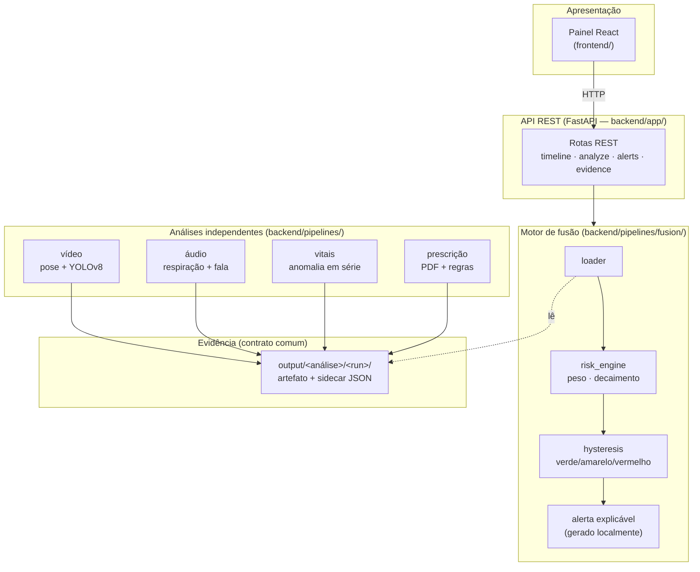
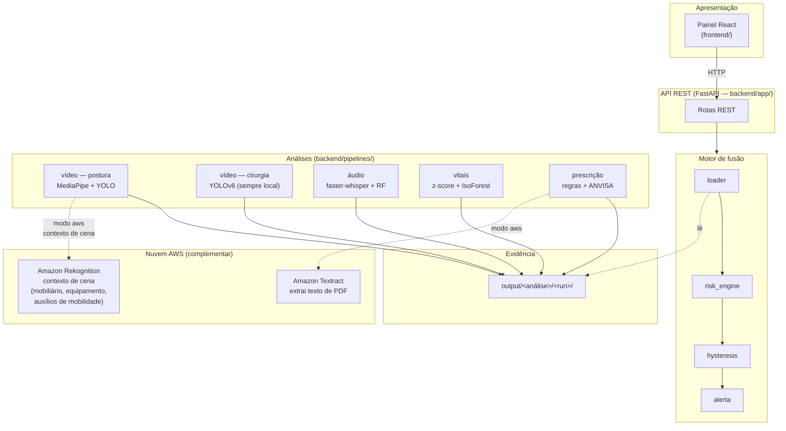

# Monitoramento Hospitalar Multimodal

[](https://www.python.org/)
[](https://fastapi.tiangolo.com/)
[](https://react.dev/)
[](https://vitejs.dev/)
[](https://docs.ultralytics.com/)
[](https://ai.google.dev/edge/mediapipe/solutions/vision/pose_landmarker)
[](https://opencv.org/)
[](https://github.com/SYSTRAN/faster-whisper)
[](https://aws.amazon.com/textract/)
[](https://aws.amazon.com/rekognition/)
[](https://www.sqlite.org/)
[](https://scikit-learn.org/)
[](https://huggingface.co/AnaPRodrigues/endoscapes-surgical-detector)

Sistema que combina quatro fontes de dados de um paciente — **vídeo, áudio, sinais
vitais e prescrições médicas** — para gerar um indicador único de risco e alertar a
equipe automaticamente quando algo preocupante é detectado.

> Tech Challenge — Fase 4 (POSTECH 8IADT). O enunciado completo do desafio está em
> [`docs/8IADT-Fase-4-Tech-challenge.md`](docs/8IADT-Fase-4-Tech-challenge.md).

**🎥 [Vídeo de demonstração](#)** &nbsp;|&nbsp; **📄 [Relatório técnico](docs/relatorio-tecnico.md)**


## Grupo 8
* Ana Paula Rodrigues Pereira (RM 369663) - aninha-felicio@hotmail.com


---

## Visão geral

O desafio proposto pela Fase 4 pede um sistema de monitoramento contínuo de pacientes
por **dados multimodais** (vídeo, áudio, sinais vitais e texto), com deteção de anomalias
em tempo real e integração com serviços gerenciados em nuvem.

A nossa solução processa quatro fontes de dados independentes, cada uma com modelos
especializados, e funde os resultados num **indicador único de risco** que evolui ao
longo do tempo. Quando o risco ultrapassa um limiar, um **alerta explicável** é gerado
automaticamente — sempre acompanhado da evidência que o justifica.

### O que o sistema faz

| Modalidade | O que analisa | Técnica / modelo |
| --- | --- | --- |
| **Vídeo — movimentação** | Postura, quedas (deteção em 2 estágios com validação temporal), desvios posturais, ângulos articulares, inclinação de tronco, agitação, saída do leito, convulsão | MediaPipe Pose + detetor de pessoas (YOLOv8n **ou** YOLO-NAS ONNX, conforme config) + tracking IoU com gate de distância + validação dinâmica $V_y$ normalizada por altura corporal + restrições temporais (descida sustentada, deslocamento líquido) + escalonamento por FPS |
| **Vídeo — cirurgia** | Estruturas anatómicas críticas em vídeo cirúrgico (keyframes a cada 2s) | YOLOv8 fine-tuned (Endoscapes2023) com evidência anotada (bboxes). **Sempre local** — o Rekognition genérico não reconhece anatomia. |
| **Vídeo — contexto de cena** (modo AWS) | Ambiente ao redor do paciente: mobiliário hospitalar, equipamento médico, auxílios de mobilidade, presença de profissionais | Amazon Rekognition `detect_labels` com filtro clínico (35 labels mapeados PT, threshold ≥ 70%) — complementa a análise postural com contexto ambiental |
| **Áudio** | Sons respiratórios (com anotação ICBHI) ou consultas (transcrição, termos críticos, fadiga vocal) — dispatch automático | Random Forest + faster-whisper + Parselmouth (jitter/shimmer/HNR) |
| **Sinais vitais** | Séries temporais: cardiotocografia fetal (CTU-UHB) e internação adulta com HR/SpO2 (BIDMC) | Deteção estatística de anomalias (z-score móvel + Isolation Forest) sobre janelas |
| **Prescrições** | Lê receitas em PDF, verifica dose, classificação ANVISA (A1/A2/B1/C1), princípio ativo e variação abrupta; geração avulsa de prescrições sintéticas | Extração de texto do PDF + regras clínicas + catálogo ANVISA (Portaria 344/98) + gerador standalone |
| **Fusão e alerta** | Combina as análises num indicador de risco (verde/amarelo/vermelho) com alerta explicável local. Um evento CRITICAL (queda, hipoxemia, MAV com dose acima da faixa) dispara VERMELHO sozinho. | Late fusion ponderada (vídeo=0.40, vitais=0.40, prescrição=0.45, áudio=0.30) com decaimento temporal + histerese (limiares 0.15/0.35) |
| **Painel** | Pacientes, envios, linha do tempo de risco, alertas e drill-down de evidência | React + Vite sobre a API |

**Princípio central — evidência sempre reproduzível.** Cada anomalia detetada gera um
artefato (imagem anotada, trecho de áudio, gráfico da janela, PDF marcado) junto de um
descritor `JSON`. O sistema nunca aponta um risco sem mostrar o porquê — e essa
evidência é a única "cola" entre as análises e a camada de fusão.

---

## Arquitetura

O sistema é organizado em camadas, cada uma consumindo apenas a de baixo por um
contrato explícito. As quatro análises são **independentes** entre si (não se importam
umas às outras); o único ponto de contacto é o **ficheiro de evidência** que cada uma
grava em `output/<análise>/<execução>/`, e que a fusão depois lê.

### Modo local (padrão)

No modo `local`, **todo o processamento roda na própria máquina** — sem Docker, sem
conta na nuvem, sem rede:



### Modo AWS

No modo `aws` (`ENV=aws` no `.env`), **dois serviços gerenciados** são adicionados
como complemento — o resto continua 100% local:



**Fluxo de dados**: cada ficheiro enviado a um paciente é analisado pelo pipeline da sua
modalidade, que grava evidência real em disco; o resultado (achado em linguagem clínica + pontuação + evidência) fica no banco local. O motor de fusão carrega os achados do
paciente, calcula um risk score por janela de tempo (soma ponderada com decaimento
exponencial), classifica em verde/amarelo/vermelho com histerese e, ao cruzar o limiar
de disparo, gera um alerta explicável **localmente** (registado no banco e exibido pela
interface — não há envio por serviço de notificação). A API expõe esse resultado; o
painel só consome a API por HTTP. No modo `local`, as análises são 100% locais; no modo
`aws`, dois serviços gerenciados são usados como complemento (Textract para PDF,
Rekognition para contexto de cena na pipeline de postura), com o resultado voltando ao
processamento local.

### Estrutura de pastas

```
backend/
├── app/          API REST (FastAPI) + banco local de pacientes (SQLite): pacientes,
│                 envios de ficheiro, análises, linha do tempo de risco e alertas
├── common/       Compartilhado: contrato de evidência, métricas, config, log, atividade
├── pipelines/
│   ├── video/        Postura (MediaPipe) + deteção de objetos (YOLOv8)
│   ├── audio/        Respiração (ICBHI), transcrição, termos críticos, fadiga vocal
│   ├── vitals/       Deteção de anomalia em séries temporais de sinais vitais
│   ├── prescription/ Leitura de PDF + regras de dose + catálogo ANVISA
│   └── fusion/       Motor de fusão de risco + alerta explicável (local)
├── aws/          Adaptadores de nuvem: Textract e Rekognition, intercambiáveis por ENV
├── scripts/      Utilitários (download de datasets, carga de pacientes de demonstração)
└── tests/        Testes automatizados (unitários + integração)

frontend/     Painel web (React + Vite) — consome só a API, sem lógica de processamento própria
training/     Treino do detetor YOLOv8 (roda à parte, numa GPU; ver training/README.md)
models/       Pesos treinados prontos para uso (baixados do Hugging Face, não versionados)
data/         Datasets públicos + banco local (app.db) e ficheiros enviados (uploads/) — não versionados
docs/         Enunciado do desafio e relatório técnico
.specs/       Especificações, decisões de arquitetura (AD-NNN) e relatórios de verificação
```

### Padrões de desenvolvimento

- **Dois modos por adapter, escolhidos por `ENV`.** Cada capacidade que pode ser local
  ou de nuvem (extração de PDF, contexto de cena) tem duas implementações atrás de uma
  interface comum: `local` (extração local de PDF, YOLOv8) e `aws` (Textract, Rekognition). Trocar
  de modo é trocar uma variável, sem `if` espalhado. No modo `local` não há nenhuma
  chamada de nuvem; nenhum módulo instancia um cliente `boto3` direto (há teste que
  garante isso).
- **Pipeline cirúrgica sempre local.** O YOLOv8 fine-tuned para anatomia cirúrgica
  (`cystic_artery`, `cystic_duct`, `cystic_plate`) é insubstituível — o Rekognition
  genérico não reconhece estas estruturas. Esta pipeline nunca chama a nuvem.
- **Rekognition como complemento ambiental.** No modo `aws`, o Rekognition analisa o
  **contexto de cena** na pipeline de postura/movimentação (mobiliário hospitalar,
  equipamento médico, auxílios de mobilidade, presença de profissionais) — enriquecendo
  o resultado clínico com informação sobre o ambiente do paciente.
- **Treino desacoplado da inferência.** `training/` é um mundo à parte: nada em
  `backend/` importa `training/` e vice-versa. O sistema em produção **nunca treina** —
  só carrega o peso pronto (`models/best.pt`) e faz inferência. Isto mantém o ambiente
  de produção 100% CPU, sem dependências de GPU.
- **Evidência como contrato único entre camadas.** As análises não se conhecem; a fusão
  não conhece o interior de nenhuma. Todas falam o mesmo formato de evidência
  (`backend/common/evidence.py`), o que permite adicionar/trocar uma análise sem tocar
  nas outras nem na fusão.
- **Config declarativa por análise, campo desconhecido = erro.** Cada pipeline lê a sua
  própria config YAML validada estritamente — nada de parâmetro mágico silencioso.
- **Verificação independente (author ≠ verifier).** Cada funcionalidade fechada tem um
  relatório de verificação em `.specs/features/<nome>/validation.md`, produzido por uma
  passada independente que inclui um *sensor de discriminação* (injeta defeitos e
  confirma que os testes os detetam).
- **Commits atómicos e rastreáveis.** Uma tarefa = um commit; cada decisão de
  arquitetura relevante fica registada como `AD-NNN` em `.specs/STATE.md`.
- **Spec-Driven Development (SDD).** O projeto foi construído usando SDD com 4 fases
  adaptativas — Specify, Design, Tasks, Execute. As especificações, designs e
  verificações estão documentadas em `.specs/features/<nome>/`. Para detalhes do
  processo, ver `.specs/STATE.md`.

O sistema roda inteiro num processador comum (CPU) — nenhuma GPU é necessária para o
uso diário. Só o treino do detetor de estruturas cirúrgicas (`training/`) se beneficia
de uma GPU, e roda uma única vez, à parte.

---

## Modelagem do banco de dados

O sistema usa **SQLite** como banco local — sem Docker, sem servidor externo. O ficheiro
`data/app.db` é criado automaticamente na primeira execução da API.

### Tabelas principais

| Tabela | Responsabilidade | Campos-chave |
| --- | --- | --- |
| `patients` | Identidade do paciente monitorizado | `id`, `name`, `created_at` |
| `uploads` | Ficheiros enviados para análise | `id`, `patient_id`, `filename`, `modality`, `uploaded_at` |
| `analyses` | Resultado de cada análise executada | `id`, `upload_id`, `patient_id`, `modality`, `summary`, `score`, `evidence_id`, `details`, `created_at` |
| `risk_scores` | Pontuação de risco ao longo do tempo | `id`, `patient_id`, `score`, `level`, `contributing_modalities`, `window_end` |
| `alerts` | Alertas disparados por cruzamento de limiar | `id`, `patient_id`, `level`, `evidence_ids`, `summary`, `created_at` |

### Motivações

- **SQLite** foi escolhido por ser *zero-config* — não requer instalação de servidor,
  Docker, nem rede. Qualquer pessoa clona o repo e executa.
- **Uma tabela por conceito clínico** (paciente, envio, análise, risco, alerta) em vez
  de uma tabela monolítica — permite consultas independentes por caso de uso.
- **`analyses.details`** é um campo JSON que guarda metadados específicos da modalidade
  (keyframes analisados, estruturas encontradas, contexto de cena) sem forçar um schema
  rígido que travaria a evolução independente de cada pipeline.
- **`risk_scores`** guarda o histórico completo da pontuação, permitindo reconstruir
  a linha do tempo de risco de cada paciente.
- **`alerts`** usa uma chave determinística baseada nas evidências contribuintes para
  evitar alertas duplicados para o mesmo conjunto de eventos.

O mapeamento objeto-relacional está em `backend/app/db.py` e as operações de acesso a
dados em `backend/app/repositorio.py`.

---

## Pré-requisitos

- Python 3.12 ou mais recente
- Cerca de 30 GB de espaço livre em disco para os datasets públicos (a maior parte é o
  conjunto de imagens de cirurgia Endoscapes2023, ~6 GB)

Não é preciso Docker nem conta na nuvem: no modo padrão (`local`) tudo roda na máquina.

---

## Início rápido

```bash
# 1. Criar ambiente virtual e instalar
python3 -m venv .venv
source .venv/bin/activate
make install

# 2. Baixar os datasets públicos (retomável; não rebaixa o que já existe)
make data

# 3. Baixar o modelo de deteção já treinado (publicado no Hugging Face)
make models-fetch

# 4. Criar pacientes de demonstração com dados reais (idempotente)
make seed-demo

# 5. Rodar os testes
make test
```

---

## Rodar o sistema

O sistema funciona em dois modos — **local** (padrão) e **aws**. Em ambos os casos
são dois processos (API + interface), cada um no seu terminal.

### Modo local (padrão — não precisa de nada na nuvem)

No modo local, todo o processamento roda na própria máquina. **Não precisa de
credencial, rede, Docker, nem conta AWS.**

```bash
# Terminal 1 — a API (fica em http://localhost:8000)
make serve-api

# Terminal 2 — a interface (abre em http://localhost:5173; na 1ª vez: make frontend-install)
make serve-front
```

Abra `http://localhost:5173`, cadastre um paciente e envie ficheiros — ou use
`make seed-demo` para criar 3 pacientes de demonstração com dados reais.

### Modo AWS (Textract + Rekognition)

No modo `aws`, o sistema adiciona **dois serviços gerenciados** como complemento:

- **Prescrições**: chama `Textract.analyze_document()` em vez da extração local de PDF
- **Vídeo — contexto de cena**: chama `Rekognition.detect_labels()` para analisar o
  ambiente ao redor do paciente (mobiliário, equipamento, auxílios de mobilidade)
- **Vídeo — cirurgia**: **sempre local** (YOLOv8 fine-tuned) — o Rekognition genérico
  não reconhece estruturas anatómicas
- **Tudo o resto** (áudio, sinais vitais, postura): continua 100% local

A troca é controlada por **um ficheiro `.env`** e **credenciais no ambiente**.
Nenhum código muda — o factory de cliente (`backend/aws/clients.py`) injeta o
endpoint correto e os adapters (`backend/aws/adapters/`) isolam a diferença.

#### 1. Criar o ficheiro `.env`

Na raiz do projeto, ao lado do `.env.example`:

```bash
cp .env.example .env
```

Edite o `.env` e mude `ENV=local` para `ENV=aws`:

```ini
ENV=aws
AWS_REGION=us-east-1
```

*(`AWS_REGION` já vem preenchida com `us-east-1` — é a região do Learner Lab. O
`.env` está no `.gitignore` e não vai parar no Git.)*

#### 2. Exportar as credenciais da AWS

O sistema usa a cadeia de credenciais padrão do boto3. **No terminal onde a API
vai rodar**, exporte as variáveis da sua sessão AWS:

```bash
export AWS_ACCESS_KEY_ID=...
export AWS_SECRET_ACCESS_KEY=...
export AWS_SESSION_TOKEN=...
```

No **AWS Academy Learner Lab**, estas variáveis aparecem no painel "AWS Details"
do ambiente de laboratório. Basta copiá-las e colá-las no terminal.

Se preferir usar um perfil nomeado (ex.: `AWS_PROFILE=lab`), certifique-se de que
ele está configurado em `~/.aws/credentials`.

#### 3. Subir a API e a interface

```bash
# Terminal 1 — API (agora com ENV=aws + credenciais no ambiente)
make serve-api

# Terminal 2 — interface (igual ao modo local)
make serve-front
```

#### 4. Confirmar que está a usar a nuvem

O terminal da API mostra a origem de cada processamento. Com `ENV=aws`, as
chamadas aos serviços gerenciados aparecem com a etiqueta `[AWS]`:

```
14:35:04 [prescrição][AWS] Textract analyze_document — 148 blocos extraídos em 4.1s — requestId=b32c62b9
14:35:10 [vídeo][AWS] Rekognition detect_labels — cena (45321 bytes)
14:35:10 [vídeo][AWS] 23 rótulos reconhecidos em 0.8s — requestId=3a77ddf4
14:35:10 [vídeo][LOCAL] contexto clínico: Cadeira de Rodas (98%), Cama (99%), Enfermeiro (92%)
```

No modo `local` essas mesmas linhas mostram `[LOCAL]` (extração local / YOLOv8).
Assim é fácil ver, durante a demonstração, que as chamadas de nuvem são reais.

#### Resumo: o que muda entre modos

| | `local` (padrão) | `aws` |
|---|---|---|
| Extração de texto de PDF | local (pdfplumber) | Amazon Textract |
| Contexto de cena (postura) | não disponível | Amazon Rekognition |
| Deteção cirúrgica (YOLOv8) | sempre local | sempre local |
| Áudio, pose, sinais vitais | sempre local | sempre local |
| Precisa de `.env`? | não (não lê o ficheiro) | sim (`ENV=aws`) |
| Precisa de credenciais? | não | sim (variáveis de ambiente) |
| Precisa de rede? | não | sim |
| Docker? | não | não |

**Nota sobre a nuvem.** O enunciado original sugere Azure Cognitive Services; este
projeto usa **AWS** (Textract/Rekognition) como equivalente gerenciado. A
justificativa e o mapeamento serviço-a-serviço estão no relatório técnico
([`docs/relatorio-tecnico.md`](docs/relatorio-tecnico.md)).

---

## Comandos principais (Makefile)

O `Makefile` na raiz automatiza todas as operações comuns do projeto:

| Comando | O que faz |
| --- | --- |
| `make install` | Instala o projeto e as dependências de desenvolvimento no ambiente virtual ativo |
| `make data` | Baixa os 5 datasets públicos (CTU-UHB, ICBHI, Endoscapes2023, URFD, BIDMC). **Retomável e idempotente** — não rebaixa o que já existe. Verifica espaço em disco antes de cada download. |
| `make data-extra` | Baixa datasets complementares opcionais |
| `make models-fetch` | Baixa o detetor YOLOv8 fine-tuned do [Hugging Face Hub](https://huggingface.co/AnaPRodrigues/endoscapes-surgical-detector) para `models/best.pt` |
| `make serve-api` | Sobe a API (FastAPI) em `http://localhost:8000` com uvicorn e hot-reload |
| `make serve-front` | Sobe o painel (React/Vite) em `http://localhost:5173` |
| `make frontend-install` | Instala as dependências do frontend (`npm install`) |
| `make seed-demo` | Cria 3 pacientes de demonstração com dados reais e executa as análises. **Idempotente** — se já existirem, pula |
| `make gen-presc` | Gera uma prescrição avulsa em PDF (ex.: `make gen-presc ARGS="--drug paracetamol --dose 500"`) |
| `make demo` | Roda a análise de sinais vitais ponta a ponta com o cenário de demonstração |
| `make bidmc-scan` | Lista registos de internação (BIDMC) com evento clínico relevante |
| `make tts-consulta` | Gera áudio sintético de consulta para teste do pipeline de áudio |
| `make test` | Roda a suíte completa (unitários + integração; sem Docker nem nuvem) |
| `make test-unit` | Só os testes rápidos (sem integração) |
| `make lint` | Checagem de estilo com ruff |
| `make fmt` | Formatação automática com ruff |
| `make clean` | Limpa `output/`, caches Python e `__pycache__` |

---

## Usar o modelo de deteção já treinado

O detetor de estruturas cirúrgicas (YOLOv8s) foi fine-tunado sobre o
Endoscapes2023 (1212 imagens de treino, 5566 estruturas anotadas) e publicado no
[Hugging Face Hub](https://huggingface.co/AnaPRodrigues/endoscapes-surgical-detector).
Para baixá-lo:

```bash
make models-fetch
```

O treino foi feito no Google Colab (GPU T4 gratuita), comparando YOLOv8n vs. YOLOv8s.
A variante **YOLOv8s** venceu nas 4 métricas (mAP@50: 0.6046, mAP@50-95: 0.3837).
O notebook de treino está em [`training/train_yolo_endoscapes.ipynb`](training/train_yolo_endoscapes.ipynb).
Detalhes completos em [`training/README.md`](training/README.md) e
[`models/README.md`](models/README.md).

---

## Log de atividade

Enquanto a API roda, o terminal mostra cada passo com a **origem do processamento
marcada**: `[LOCAL]` quando resolvido na própria máquina, `[AWS]` quando houve
chamada a um serviço gerenciado (com o serviço, a duração e o `requestId` da
resposta AWS). Exemplo:

```
14:32:07 [paciente:p-0007] ficheiro recebido — modalidade=áudio, consulta_01.wav (2.3 MB)
14:32:11 [áudio][LOCAL] classificando ciclos respiratórios (treino sob demanda)
14:32:12 [risco] pontuação 0.31 -> 0.55 — nível AMARELO
14:35:04 [prescrição][AWS] Textract analyze_document — 148 blocos extraídos em 4.1s — requestId=b32c62b9
14:35:10 [vídeo][AWS] Rekognition detect_labels — cena (45321 bytes)
14:35:10 [vídeo][AWS] 23 rótulos reconhecidos em 0.8s — requestId=3a77ddf4
14:35:10 [vídeo][LOCAL] contexto clínico: Cadeira de Rodas (98%), Cama (99%)
```

---

## Sobre os dados usados

Todas as análises usam datasets **públicos, reais e anonimizados** (nunca dados
sintéticos ou fabricados, exceto onde documentado explicitamente) — ver
[`data/README.md`](data/README.md) para a origem exata de cada um. Nenhum contém
informação identificável de paciente.

---

## Testes e qualidade

```bash
make test         # suíte completa (unitários + integração; sem Docker nem nuvem)
make test-unit    # só os rápidos
make lint         # checagem de estilo (ruff)
```

### Estrutura de testes

- **Testes unitários** (`backend/tests/`): cobrem cada pipeline isoladamente com
  dublês (mocks) para dependências externas. Não requerem datasets reais.
- **Testes de integração** (marcados `@pytest.mark.integration`): correm sobre
  dados reais dos datasets. São executados quando os datasets estão presentes
  (`make data`).
- **Sensor de discriminação**: cada funcionalidade tem testes que injetam defeitos
  conhecidos e confirmam que o sistema os deteta (mutation testing manual).

### Cobertura atual

| Área | Testes | Cobertura |
| --- | --- | --- |
| Vídeo — postura | Unitários + integração URFD | 80% recall, 100% precisão (10 sequências) |
| Vídeo — cirurgia | Unitários com dublê YOLO + integração Endoscapes | mAP@50 0.6046 (teste oficial) |
| Áudio — respiração | Unitários + integração ICBHI | 4 classes (normal/crackle/wheeze/both) |
| Áudio — consulta | Unitários com dublê de transcrição | Cobertura estrutural completa |
| Sinais vitais (CTG) | 165 testes; 16/17 mutações mortas | z-score + Isolation Forest |
| Sinais vitais (BIDMC) | 8 testes de integração | HR + SpO2 com referência clínica |
| Prescrições | Unitários + regras clínicas | Catálogo ANVISA 30 fármacos |
| Fusão e alerta | Unitários de motor + histerese + alerta | Cobertura de transições de estado |
| Contexto de cena | 10 testes (helper + integração pose) | Cobertura ENV local/aws, falha, threshold |

Cada funcionalidade fechada tem um relatório de verificação independente em
`.specs/features/<nome>/validation.md` (cobertura por critério de aceite + sensor de
mutação). O estado atual e as decisões de arquitetura ficam em `.specs/STATE.md`.

---

## Referências do repositório

| Documento | Conteúdo |
| --- | --- |
| [`docs/8IADT-Fase-4-Tech-challenge.md`](docs/8IADT-Fase-4-Tech-challenge.md) | Enunciado original do desafio |
| [`docs/relatorio-tecnico.md`](docs/relatorio-tecnico.md) | Relatório técnico com resultados e decisões |
| [`backend/README.md`](backend/README.md) | Estrutura detalhada do backend |
| [`data/README.md`](data/README.md) | Origem exata de cada dataset |
| [`models/README.md`](models/README.md) | Proveniência do modelo treinado |
| [`training/README.md`](training/README.md) | Passo a passo do treino do YOLOv8 |
| [`.specs/STATE.md`](.specs/STATE.md) | Decisões de arquitetura e estado do projeto |
| [`.specs/features/<nome>/validation.md`](.specs/features/) | Relatórios de verificação por funcionalidade |
